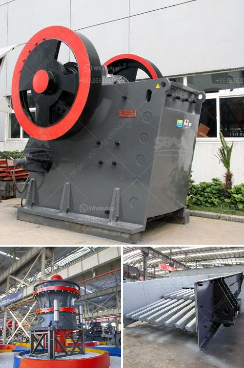

<h3>ball mill working in hindi</h3>
बॉल मिल एक प्रमुख उपकरण है जो रेतीले और अन्य काठीमाण्य सामग्री को क्रश करने के लिए उपयोग होता है। यह इटली में बनाया गया था और विभिन्न उद्योगों में व्यापक रूप से प्रयोग होता है, जैसे कि सीमेंट, सिद्धांत, कैमिकल्स, नॉन-फेरस मेटल्स और अन्यों के लिए कीटाणु अभाय पोषण करने के लिए।

इसका आदान-प्रदान कार्य यह है कि इसमें मण्डली और शंक के बिच में टंकण होता है जिससे कि काठीमाण्य सामग्री को आवश्यक आकार में परिवर्तित किया जा सके। बॉल मिल में गति सबसे महत्त्वपूर्ण होती है जो कि मण्डली को ऐसे पीसेदार दबाव पर लाती है जो कि पिसाई प्रक्रिया को प्रारंभ करता है।

बॉल मिल में बाल्स होते हैं जिनका उपयोग प्रक्रिया के दौरान सामग्री के बेंच कांच पर मारने के लिए किया जाता है। इस प्रक्रिया में बॉल्स ही परिस्थितियों को उत्पन्न करते हैं जिससे कि सामग्री पर दबाव लागे और उसे पीसा जा सके। यह दबाव सामग्री की पीसाई को बढ़ाता है और बाल्स की आवश्यक्ता परिस्थितियों के अनुरूप बदल सकती है।

बॉल मिल की चर्चा करते समय इसके आकार की भी महत्त्वपूर्ण भूमिका होती है। इसका चयन सामग्री के प्रकृति और चयनित आकार पर निर्भर करता है। सामान्य तौर पर, बड़े बॉल मिल उपयोग होते हैं जब सामग्री अधिक मात्रा में पिसी जाने की आवश्यकता होती है। छोटे बॉल मिल उपयोग होते हैं जब पाउडर का कचरा प्रामुख होता है और सामग्री की आवश्यकता छोटी होती है।

बॉल मिल के कार्यान्वयन के दौरान इसकी धरावाहिक सामग्री के अपटकने पर सुनिश्चित करती है जिससे कि असमान पाटवों का उत्पादन कर प्रक्रिया का समय बचाया जा सके। इसके अलावा, यह ध्यान देती है कि सामग्री के पुडिंग पाटव पर समान दबाव पैदा होता है ताकि परिणामस्वरूप उत्पादन होमोजीन हो।

बॉल मिल कार्य का इस्तेमाल प्रतिस्पर्धी व्यापार में क्रमिक रूप से बढ़ रहा है। इसकी महत्त्वपूर्ण कार्यक्षमता, उच्च पैमाने पर स्केल और वाणिज्यिक उद्योगों में बढ़ रही आवश्यकताओं के साथ बॉल मिल कार्य एक अच्छा निर्माण कार्यक्रम है। इसकी तकनीकियां और अनुकूलन बॉल मिल के कार्य में महत्त्वपूर्ण होती हैं, जिससे विभिन्न उद्योगों में उपयोग किया जा सके।

संक्षेप में, बॉल मिल एक उपकरण है जिसका उपयोग सामग्री के क्रश करने के लिए किया जाता है। यह उद्योगों में व्यापक रूप से उपयोग होता है और पाउडर या कचरावाला उत्पादन करने की क्षमता रखता है। बॉल मिल की संरचना, आकार, और धरावाहिक महत्त्वपूर्ण होती है जो इसके कार्य को सुनिश्चित करने में मदद करती है। इसके कार्य में अनुकूलन और तकनीकी पहलें भी महत्त्वपूर्ण होती हैं जिससे इस उपकरण को उद्योगों में सफलतापूर्वक इस्तेमाल किया जा सके।
<h3>Contact us</h3><ul><li><strong>Whatsapp:&nbsp;<a href="https://wa.me/8613661969651">+8613661969651</a></strong></li><li><a href="https://swt.shibang-china.com/?git&amp;zhl&amp;ball mill working in hindi"><strong>Online Service(chat now)</strong></a></li></ul><h3>Related</h3><ul><li><a href='concrete aggregate crushing plant.md'>concrete aggregate crushing plant</a></li><li><a href='technical features of stone crusher.md'>technical features of stone crusher</a></li><li><a href='how to make a business plan for crusher plant.md'>how to make a business plan for crusher plant</a></li><li><a href='graphite mining process.md'>graphite mining process</a></li><li><a href='cement plant operations handbook.md'>cement plant operations handbook</a></li></ul>