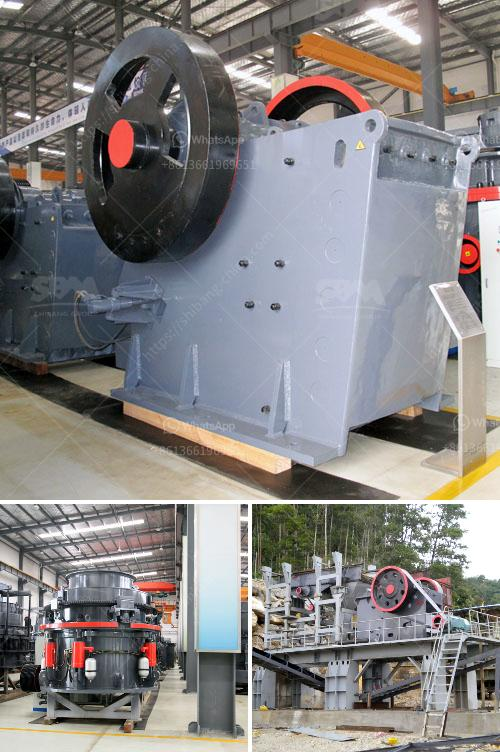

<h3>ball milling grinding machine in namibia</h3>
Namibia is a country in southern Africa known for its vast and diverse mineral resource base. It is a leading producer of minerals such as diamonds, uranium, and zinc. To maximize the extraction and processing of these minerals, effective grinding and milling equipment is crucial. Ball milling grinding machines are widely used in the mining industry to grind various ores and rocks, especially in metal and non-metal mines.

A ball mill is a cylindrical machine consisting of a hollow cylinder and grinding balls made of steel, ceramic, or rubber. The ball mill is filled with different sizes of grinding media and the ore particles undergo grinding by the collision and friction between the grinding media and the ore particles. The grinding process helps to reduce the size of the ore particles, increase the surface area for mineral liberation, and improve the efficiency of downstream processes such as flotation or leaching.

One of the key advantages of ball milling grinding machines is their versatility. They can grind a wide range of materials, including minerals, ores, chemicals, and ceramics. This flexibility allows operators to optimize the grinding process according to the specific requirements of their ore or product. Additionally, ball mills can be operated in either wet or dry conditions, further enhancing their adaptability.

In Namibia, where water is a scarce resource, dry grinding is often preferred. Dry ball milling reduces the need for water and eliminates the potential for water contamination. This is particularly important in mineral processing plants where water is used for various purposes, such as flotation, dewatering, and dust suppression. Dry grinding also reduces the energy consumption associated with the evaporation process, leading to lower operational costs.

To enhance the grinding efficiency of ball milling machines, several factors should be considered. Firstly, the loading capacity of the mill should be optimized. Overloading the mill with excessive material may cause the grinding media and ore particles to occupy a smaller space, leading to reduced grinding efficiency. Operators should carefully control the feed rate and ensure a balanced and steady material flow into the mill.

Secondly, the size and composition of the grinding media play a crucial role in the grinding process. The grinding balls should be of the appropriate size distribution to achieve efficient grinding. A mixture of different sizes of grinding balls may improve the overall grinding performance. Additionally, the choice of grinding media material, such as steel, ceramic, or rubber, can affect the wear resistance and grinding efficiency of the mill.

Furthermore, maintaining the proper operating conditions of the ball mill is vital. This includes regular monitoring of the mill speed, grinding media filling rate, and slurry density. Adjustments can be made to optimize these parameters and ensure the mill operates at its maximum efficiency.

In conclusion, ball milling grinding machines are an essential tool in the mining industry, especially in mineral processing plants in Namibia. Their versatility, ability to operate in both wet and dry conditions, and efficiency make them indispensable for ore grinding. By optimizing the loading capacity, grinding media size and composition, and operating conditions, operators can enhance the grinding efficiency of these machines, leading to improved productivity and profitability in the mining sector in Namibia.
<h3>Contact us</h3><ul><li><strong>Whatsapp:&nbsp;<a href="https://wa.me/8613661969651">+8613661969651</a></strong></li><li><a href="https://swt.shibang-china.com/?git&amp;zhl&amp;ball milling grinding machine in namibia"><strong>Online Service(chat now)</strong></a></li></ul><h3>Related</h3><ul><li><a href='stone crusher sale in peru.md'>stone crusher sale in peru</a></li><li><a href='price for mobile stone crushers in japan.md'>price for mobile stone crushers in japan</a></li><li><a href='stone crusher details.md'>stone crusher details</a></li><li><a href='rock crusher price.md'>rock crusher price</a></li><li><a href='mobile impact crusher in road construction.md'>mobile impact crusher in road construction</a></li></ul>