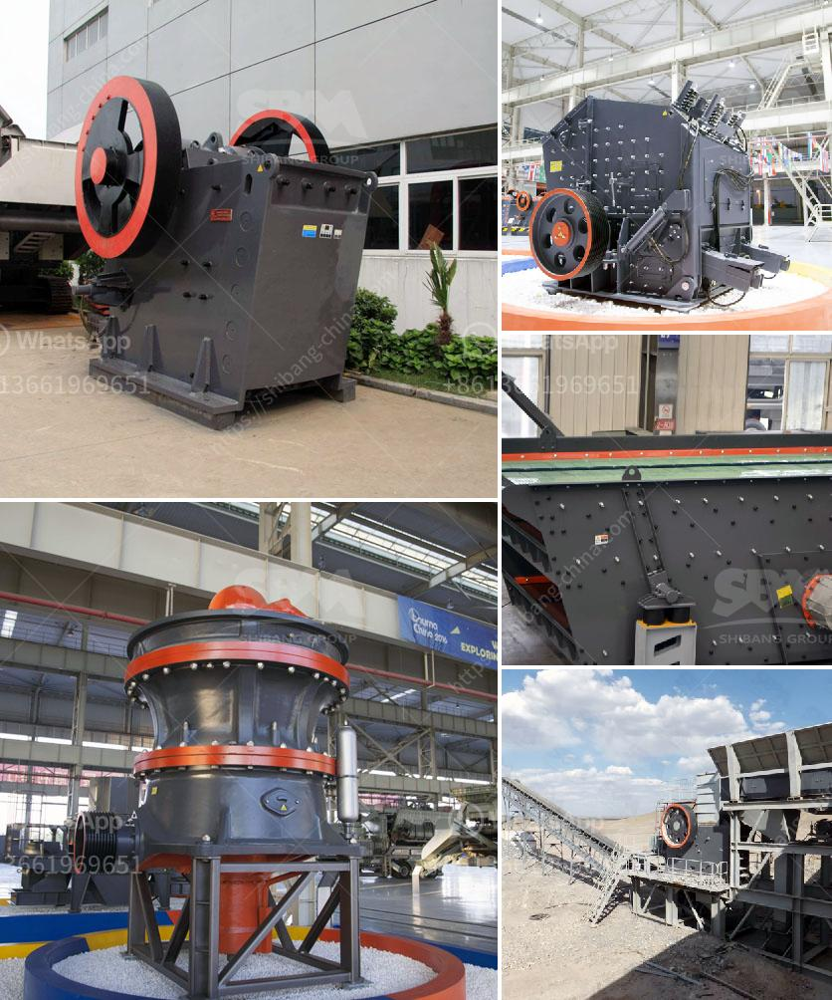

<h3>ball mills for 6 x 6 mining</h3>
Ball mills have been widely utilized in the mining industry for almost a century. The primary purpose of these mills is to reduce the size of ore particles, resulting in a more refined product for further processing. As mining operations continue to expand, ball mills have become an essential tool for efficiently grinding materials and ensuring the optimal extraction of valuable minerals.

One common application of ball mills in the mining industry is for grinding coal or limestone. These materials are first crushed to a smaller size using a jaw crusher or gyratory crusher. The crushed material is then ground in a ball mill, creating a fine powder which can be easily handled and processed.

The efficiency of a ball mill is determined by its speed, size, and quantity of grinding media. In 6 x 6 mining, a ball mill with a diameter of 6 feet and a length of 6 feet is commonly used. This size allows for the efficient grinding of large quantities of material, resulting in a high processing capacity. Typically, ball mills in mining operations are powered by rotating cylinders, which contain grinding media such as steel balls or rods. As the cylinder rotates, the grinding media tumble and crush the ore particles, reducing their size until they can pass through a screen or grate.

Beyond their primary function of grinding ore, ball mills also play a crucial role in the extraction process. After milling, the fine powder is typically mixed with water to create a slurry, which is then treated with chemicals to enable the separation of valuable minerals from the waste material. This process, known as froth flotation, relies on the precise control of particle size achieved through ball milling.

Given the importance of ball mills in mining operations, it is crucial to ensure their proper operation and maintenance. Regular inspections and maintenance activities should be carried out to check for any wear and tear, as well as the alignment and condition of the mill internals. Lubrication of the moving parts and monitoring of the temperature and vibration levels are also essential to prevent breakdowns and optimize performance.

In recent years, advancements in technology have led to the development of more efficient, energy-saving ball mills. These mills incorporate innovative design features such as improved liners and grates, as well as the use of high-pressure grinding rolls (HPGR) in combination with ball milling. HPGR technology has been shown to significantly reduce energy consumption and increase throughput, making it an attractive option for larger-scale mining operations.

In conclusion, ball mills are an indispensable tool in the mining industry for grinding ore and facilitating the extraction of valuable minerals. In 6 x 6 mining, these mills offer high processing capacity and efficiency. Proper operation and maintenance are vital to ensure optimal performance and avoid costly breakdowns. With ongoing technological advancements, ball milling continues to evolve as a key process for ore processing in the mining industry.
<h3>Contact us</h3><ul><li><strong>Whatsapp:&nbsp;<a href="https://wa.me/8613661969651">+8613661969651</a></strong></li><li><a href="https://swt.shibang-china.com/?git&amp;zhl&amp;ball mills for 6 x 6 mining"><strong>Online Service(chat now)</strong></a></li></ul><h3>Related</h3><ul><li><a href='price high energy ball milling.md'>price high energy ball milling</a></li><li><a href='vertical roller mill for cement german.md'>vertical roller mill for cement german</a></li><li><a href='stone crushers in china.md'>stone crushers in china</a></li><li><a href='hand gold washing plant sale.md'>hand gold washing plant sale</a></li><li><a href='granite quarry plants for sale.md'>granite quarry plants for sale</a></li></ul>