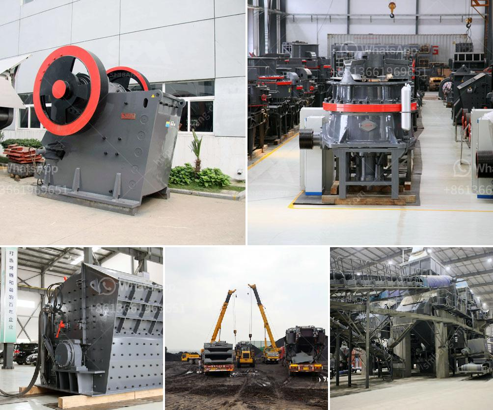

<h3>ball mills for open pit mine</h3>
Ball mills are utilized in several industries including mining and construction. It plays a crucial role in grinding materials such as copper, gold, iron ore, and other minerals. These materials are required to be finely ground for mineral liberation, enrichment, and beneficiation processes. The working principle of a ball mill is simple; it pumps out a slurry, crushes the ore into a fine powder, and mixes it with water to create a uniform and homogenous mixture. This mixture is then transported to the mill for further processing.

One key advantage of using a ball mill is that it is easy to operate and handle even for inexperienced operators. The mill's cylindrical container rotates around its axis, causing the grinding media (steel balls) inside it to cascade and grind the material. The ore is fed into the mill through a hollow trunnion at one end and discharged through a grate at the other end. This ensures the material is efficiently ground to the desired size.

Ball mills are commonly used in open pit mines due to their ability to grind large quantities of material in a single batch. The robust design of these mills enables them to accommodate high ball loads without affecting the grinding efficiency. Additionally, the size of the balls and their distribution within the mill can be adjusted to achieve the desired grinding effect.

The process of grinding in a ball mill involves multiple stages. Initially, the ore is crushed into smaller particles by a primary crusher. From there, it is sent to a secondary crusher to further reduce its size. Finally, the crushed ore is ground in the ball mill. As the mill rotates, the grinding media crush and grind the ore particles into a fine powder.

The ground ore then goes through a series of processes, including flotation, leaching, or magnetic separation, depending on the desired final product. Ball mills are often used in combination with other equipment such as classifiers, cyclones, and pumps to optimize the grinding process and ensure the desired product quality.

However, there are some challenges associated with using ball mills in open pit mines. The high energy consumption of these mills can result in significant operational costs. Additionally, the wear and tear of the grinding media and the lining of the mill can lead to increased maintenance requirements. To mitigate these challenges, operators must regularly monitor and maintain the equipment to ensure its optimal performance.

In conclusion, ball mills are vital equipment in open pit mines for the grinding of raw materials. They play a crucial role in the enrichment and beneficiation processes required to extract valuable minerals. Despite the challenges associated with their use, ball mills are widely used due to their efficiency and reliability. Continuous monitoring and maintenance of these mills are essential to ensure smooth operations and minimize downtime.
<h3>Contact us</h3><ul><li><strong>Whatsapp:&nbsp;<a href="https://wa.me/8613661969651">+8613661969651</a></strong></li><li><a href="https://swt.shibang-china.com/?git&amp;zhl&amp;ball mills for open pit mine"><strong>Online Service(chat now)</strong></a></li></ul><h3>Related</h3><ul><li><a href='kaolin processing equipment fabricators in nigeria.md'>kaolin processing equipment fabricators in nigeria</a></li><li><a href='barite mining process.md'>barite mining process</a></li><li><a href='small scale mining project proposal.md'>small scale mining project proposal</a></li><li><a href='jaw stone crusher in turkey.md'>jaw stone crusher in turkey</a></li><li><a href='lime morter grinding machine price list.md'>lime morter grinding machine price list</a></li></ul>