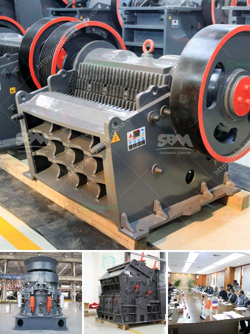

<h3>ball mills vietnam</h3>
Ball mills in Vietnam have gained immense popularity and have become one of the go-to options for crushing and grinding materials. These machines are primarily designed for grinding materials such as rocks, minerals, ores, and other solid materials into a fine powder. The use of ball mills in various industries, such as mining, construction, ceramics, and chemicals, has proven to be efficient and reliable.

One of the key benefits of using ball mills in Vietnam is their versatility. These machines can be used for both dry and wet grinding, making them suitable for a wide range of applications. Their flexibility allows users to process different materials with varying degrees of hardness, ensuring consistent and high-quality results.

Vietnam's ball mills are designed with advanced technology and innovative features to optimize performance and efficiency. They are equipped with a robust motor and a durable construction, allowing them to withstand heavy-duty use in demanding environments. Additionally, these mills come with various control systems that enable precise control over the grinding process, ensuring a consistent and uniform output.

Another advantage of ball mills in Vietnam is their energy efficiency. These machines are designed to minimize energy consumption while maximizing the grinding capacity. The use of advanced grinding media also helps in reducing energy requirements. This not only results in cost savings but also reduces the environmental impact.

In Vietnam, ball mills are available in different sizes and capacities to meet the specific needs of various industries. Whether you require a small-scale laboratory mill or a larger industrial mill, there are numerous options available to cater to your requirements.

Overall, ball mills in Vietnam have proven to be a reliable and cost-effective solution for crushing and grinding applications. With their versatility, efficiency, and advanced features, these machines have become an integral part of various industries in the country. Whether for mining, construction, or chemical applications, ball mills in Vietnam are the preferred choice for many professionals in the field.
<h3>Contact us</h3><ul><li><strong>Whatsapp:&nbsp;<a href="https://wa.me/8613661969651">+8613661969651</a></strong></li><li><a href="https://swt.shibang-china.com/?git&amp;zhl&amp;ball mills vietnam"><strong>Online Service(chat now)</strong></a></li></ul><h3>Related</h3><ul><li><a href='functions conical crusher.md'>functions conical crusher</a></li><li><a href='coal grinding machinery manufacture in india.md'>coal grinding machinery manufacture in india</a></li><li><a href='balls for mining mill.md'>balls for mining mill</a></li><li><a href='used small rotary kiln price russia.md'>used small rotary kiln price russia</a></li><li><a href='used ball mills for sale.md'>used ball mills for sale</a></li></ul>