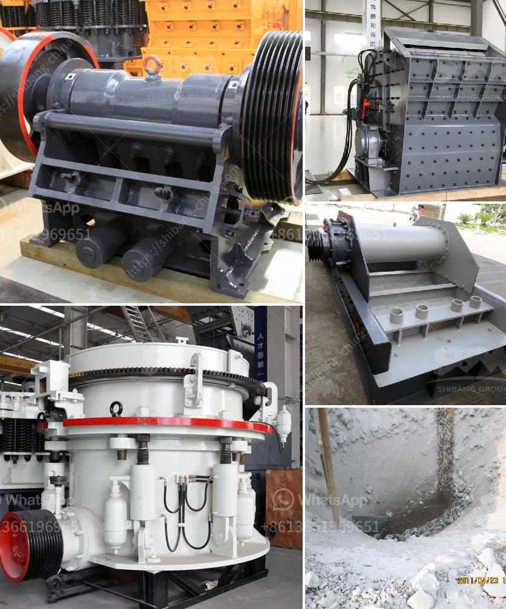

<h3>ballast crusher line</h3>
Ballast refers to coarse gravels used to lay road or railway subgrades. The main function of ballast is to support the railway sleepers and divert any moisture away from the tracks, preventing the rails from getting damaged. Therefore, ballast crusher line is essential in the railroad construction.

Crushing process is the first step of ballast production line. The machine is equipped with vibrating feeder, jaw crusher, impact crusher, cone crusher, vibrating screens, conveyors, etc. We can choose different crushing equipment according to different requirements of our customers.

Ballast stone crushing process usually starts from the first level of coarse crushing. The machine breaks down oversized rocks and removes any impurities continuously. The second level of crushing will further reduce the size of the rocks to the desired dimensions. At this stage, cone crushers or impact crushers can be used.

After that, the crushed stones will move through vibrating screens, which will classify them into different sizes. The final products will be stored in designated areas for transportation and use in the railroad construction.

In addition to the primary crushing process, secondary and tertiary crushing are also important stages in the ballast production line. These processes ensure that the final ballast is of high quality and meets the specific requirements for railway construction.

Overall, ballast crusher line plays a crucial role in the construction of railways. It helps to ensure the stability and durability of the tracks, providing a safe and smooth journey for trains. Therefore, investing in a high-quality ballast crusher line is a wise choice for contractors and railway construction companies.
<h3>Contact us</h3><ul><li><strong>Whatsapp:&nbsp;<a href="https://wa.me/8613661969651">+8613661969651</a></strong></li><li><a href="https://swt.shibang-china.com/?git&amp;zhl&amp;ballast crusher line"><strong>Online Service(chat now)</strong></a></li></ul><h3>Related</h3><ul><li><a href='brick machine canada suppliers.md'>brick machine canada suppliers</a></li><li><a href='product of crushing plant.md'>product of crushing plant</a></li><li><a href='ton per hour stone crusher plant.md'>ton per hour stone crusher plant</a></li><li><a href='simple diagram for high energy ball milling.md'>simple diagram for high energy ball milling</a></li><li><a href='m sand project cost details.md'>m sand project cost details</a></li></ul>