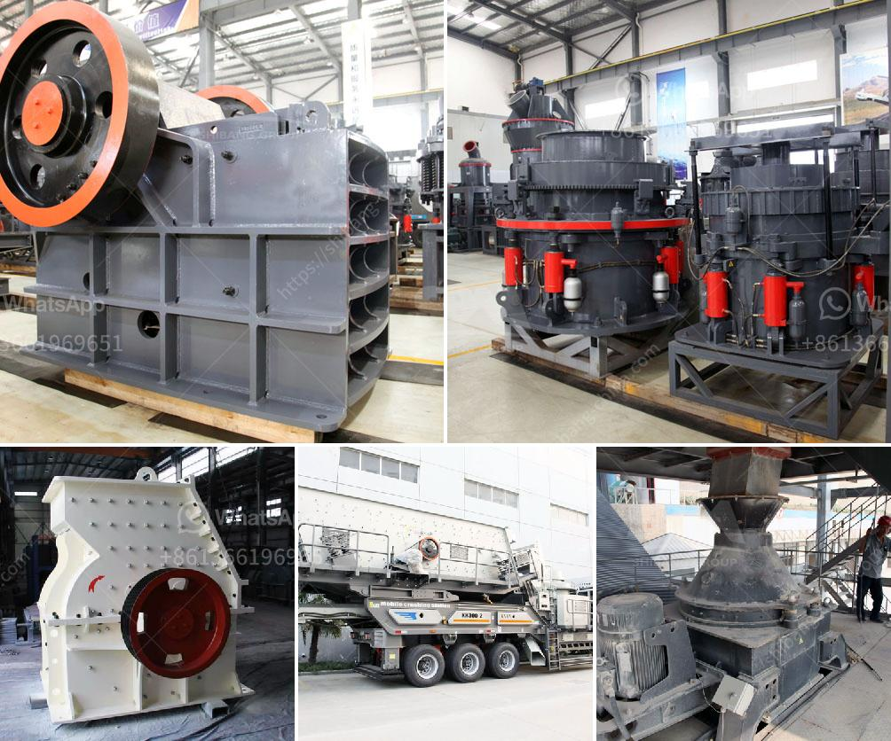

<h3>ballast crushing machine kenya</h3>
Ballast crushing machine in Kenya is widely used in the fields of mining, metallurgy, construction, chemical and other industries. It is suitable for crushing all kinds of stones and rocks, such as granite, limestone, basalt, shale, river stone, bluestone, sandstone, calcium carbide, iron ore, copper ore, etc.

Ballast crushing machine in Kenya, portable ballast crusher for sale, is a professional manufacturer of stone crushers, we have 30 years of experience in ballast crusher and ballast grinding mill. The crushing equipment used in the whole production line of ballast crusher machine is mainly including vibrating feeder, jaw crusher, impact crusher, vibrating screen, belt conveyor, and so on.

As Kenya is a developed country, the demand for ballast is growing steadily, especially in the regions of Nairobi and Mombasa. Therefore, the investment of ballast crushing machine in Kenya is quite promising. Ballast crushing machine price in Kenya is relatively fair compared with other countries. With the rapid economic development of Kenya, more and more investors are focused on the railway and real estate industries. The production of ballast making machine marks that slag grinding technology has become a mature cement production technology in Kenya.

The crushing production line located in Kenya, is put into production. The stone crushed by the jaw crusher is irregularly shaped, and has a large amount of powder. The medium-sized material is sent to the sand making machine for further crushing and shaping. The finely crushed material is transported to the vibrating screen for screening. The material that meets the particle size requirements of the finished product is sent to the sand washing machine for cleaning. After cleaning, the finished product conveyor directly transports the finished product to the finished material stack. The oversized material is recycled to the sand making machine for secondary crushing and shaping. The finished product is refined, and the unqualified material is returned to the sand making machine for reprocessing.

With the high demands in Kenya, more and more investors pay attention to ballast crushing. In order to solve the problem of large amount of powder increasing, it is necessary to select a crusher with remediation function. It appears that Kenya's demand for ballast stone crushers is constantly increasing.

We are a leading manufacturer of ballast crusher machine. Our company specializes in the production of mining equipment for more than 30 years, providing high-quality products and reliable service to customers around the world. With the development of technology, innovation and continuous improvement, our ballast crusher machine has been exported to many countries and won high praise. If you are interested in our ballast crushing machine, please contact us for more information.
<h3>Contact us</h3><ul><li><strong>Whatsapp:&nbsp;<a href="https://wa.me/8613661969651">+8613661969651</a></strong></li><li><a href="https://swt.shibang-china.com/?git&amp;zhl&amp;ballast crushing machine kenya"><strong>Online Service(chat now)</strong></a></li></ul><h3>Related</h3><ul><li><a href='company manufactures the best ball mill.md'>company manufactures the best ball mill</a></li><li><a href='roller mill nigeria.md'>roller mill nigeria</a></li><li><a href='complete rock crusher machine prices in pakistan.md'>complete rock crusher machine prices in pakistan</a></li><li><a href='capital cost gold processing plant.md'>capital cost gold processing plant</a></li><li><a href='mill grinding plants balls.md'>mill grinding plants balls</a></li></ul>