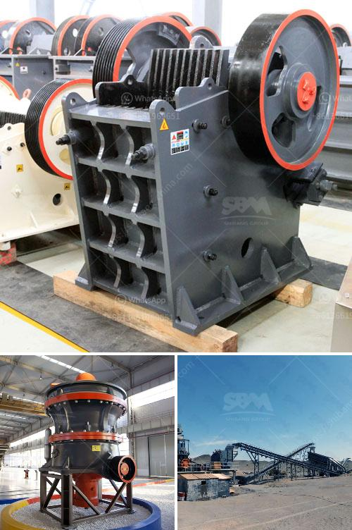

<h3>ballast crushing plant</h3>
Ballast, also known as railway track ballast, is a layer of crushed stone or gravel that forms the bed on which railway tracks are laid. It is packed between, below, and around the ties and serves as a supportive base for the railway tracks.

Ballast crushing plants play a significant role in the production of railroad ballast. With the growing demand for rail infrastructure improvements, the importance of ballast crushing plants cannot be overstated. In order to ensure the consistency and quality of railroad tracks, ballast materials need to be crushed to a specific size. This is where ballast crushing plants come into play.

A ballast crushing plant consists of a large crushing machine that processes rocks into smaller pieces. The rocks are placed in a feeding hopper or conveyor belt where they are conveyed to the crusher for further crushing. Once the rocks are crushed into the desired size, they are sorted and separated into different grades of ballast.

Crusher spare parts play a crucial role in the performance and availability of a ballast crushing plant. They are critical components that ensure the smooth operation of the plant, allowing crushing machinery to run efficiently. Crusher spare parts are commonly replaced components that are used in various stages of the crushing process. Many manufacturers offer a wide range of crusher spare parts, including jaw plates, bowl liners, counterweight liners, mantle nuts, and more.

Regular maintenance and replacement of crusher spare parts is essential to minimize downtime and ensure the plant operates at its maximum potential. When these parts wear out or break, they need to be replaced promptly to avoid any significant impact on the plant's performance. Failure to replace worn-out or broken crusher spare parts can result in reduced production capacity, increased energy consumption, and even complete shutdown of the plant.

Investing in high-quality crusher spare parts is a cost-effective way to ensure the reliability and longevity of a ballast crushing plant. High-quality spare parts allow the crushing machinery to work efficiently and effectively, minimizing the risk of unexpected breakdowns and ensuring optimal output. By regularly inspecting and maintaining the crusher spare parts, plant operators can prolong the life of their equipment, reduce repair costs, and achieve higher productivity levels.

In conclusion, ballast crushing plants are essential for the construction and maintenance of railway tracks. Crusher spare parts are crucial components that ensure the smooth operation of these plants. Regular maintenance and replacement of crusher spare parts are necessary to ensure optimal performance and productivity. Investing in high-quality spare parts will ultimately save time, money, and resources, leading to a more sustainable and efficient ballast crushing process.
<h3>Contact us</h3><ul><li><strong>Whatsapp:&nbsp;<a href="https://wa.me/8613661969651">+8613661969651</a></strong></li><li><a href="https://swt.shibang-china.com/?git&amp;zhl&amp;ballast crushing plant"><strong>Online Service(chat now)</strong></a></li></ul><h3>Related</h3><ul><li><a href='belt conveyor design free.md'>belt conveyor design free</a></li><li><a href='used mobile jaw crusher sale.md'>used mobile jaw crusher sale</a></li><li><a href='stone crusher plant south africa.md'>stone crusher plant south africa</a></li><li><a href='roller coal mill.md'>roller coal mill</a></li><li><a href='quartz grinding machine.md'>quartz grinding machine</a></li></ul>