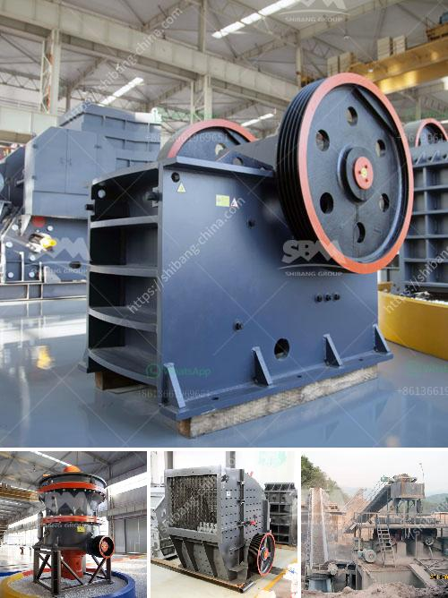

<h3>ballast machines for sale in kenya</h3>
When it comes to construction projects, one essential material that is often overlooked is ballast. Ballast serves as the foundation and stability of railway tracks, roads, and buildings. It is commonly composed of crushed stones, gravel, and sand, providing structural support and preventing any shifting or settlement.

In Kenya, the demand for quality ballast has grown substantially due to the country's ambitious infrastructure development plans. With the government investing heavily in transportation networks, including railway systems, highways, and airport expansion projects, the need for reliable suppliers of ballast machines has become vital for the construction industry.

Ballast machines, also referred to as ballast crushers, are heavy-duty machinery used to break stones into smaller sizes for easier transportation or further construction purposes. These machines play a crucial role in ensuring the durability and stability of infrastructure projects, making them indispensable in the construction sector.

With the increasing demand for ballast in Kenya, numerous suppliers have emerged, offering a variety of ballast machines for sale. These machines come in different sizes, capacities, and functionalities to cater to the diverse requirements of construction projects.

One of the prominent suppliers of ballast machines in Kenya is Mwafrika Ballast Crushers. The company specializes in providing affordable and high-quality ballast crushers, designed to crush stones into various sizes. Their machines are robust and durable, capable of withstanding the harsh conditions of construction sites. Mwafrika Ballast Crushers also offer excellent after-sales services, ensuring that their customers' needs are met throughout the entire construction process.

Another notable supplier is Camco Equipment Kenya Limited. The company offers a wide range of ballast machines, including jaw crushers, cone crushers, impact crushers, and VSI crushers. These machines are known for their efficiency, reliability, and cost-effectiveness. Camco Equipment Kenya Limited is committed to delivering state-of-the-art machinery that meets international standards, providing construction companies with the tools they need to complete their projects successfully.

Apart from supplying ballast machines, both Mwafrika Ballast Crushers and Camco Equipment Kenya Limited also offer technical support and training for their customers' construction teams. This ensures proper operation and maintenance of the machines, thus maximizing their lifespan and productivity.

Having reliable suppliers of ballast machines in Kenya is crucial for the country's construction industry. Not only do they help meet the growing demand for quality ballast, but they also contribute to the overall efficiency and success of infrastructure projects. By investing in durable, efficient, and cost-effective ballast machines, construction companies can enhance their productivity and deliver high-quality results.

In conclusion, ballast machines are essential equipment in the construction industry, especially in Kenya with its expanding infrastructure development plans. The availability of reliable suppliers, such as Mwafrika Ballast Crushers and Camco Equipment Kenya Limited, ensures that construction projects are equipped with top-quality machinery for breaking and processing stones into ballast. As the demand for ballast in Kenya continues to rise, it is crucial for construction companies to invest in these machines to ensure the stability, durability, and success of their projects.
<h3>Contact us</h3><ul><li><strong>Whatsapp:&nbsp;<a href="https://wa.me/8613661969651">+8613661969651</a></strong></li><li><a href="https://swt.shibang-china.com/?git&amp;zhl&amp;ballast machines for sale in kenya"><strong>Online Service(chat now)</strong></a></li></ul><h3>Related</h3><ul><li><a href='clay crusher price.md'>clay crusher price</a></li><li><a href='hammer mill design plans pdf mtm crusher.md'>hammer mill design plans pdf mtm crusher</a></li><li><a href='quartz mining equipments.md'>quartz mining equipments</a></li><li><a href='impact crusher saudi arabia.md'>impact crusher saudi arabia</a></li><li><a href='quartz crusher for sale.md'>quartz crusher for sale</a></li></ul>