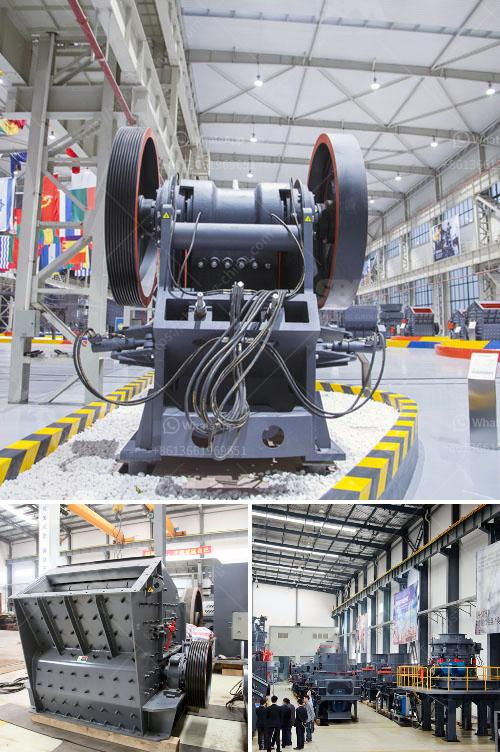

<h3>ballast making machine kenya in kenya</h3>
Kenya, a country in East Africa, has been experiencing a construction boom in recent years. This has led to a high demand for building materials, including ballast - a crucial component in the construction of railways, roads, and buildings.

In response to this growing demand, many entrepreneurs and investors have ventured into ballast making machines as a viable business opportunity. These machines are used to crush large stones into smaller pieces, making it easier to transport and use for construction purposes.

One popular ballast making machine in Kenya is the mobile crusher. It is flexible in moving, hence it is suitable for construction sites that require changing locations from time to time. This machine is capable of crushing hard rocks such as granite and basalt with a crushing power of up to 350 tons per hour. The crushed material can be used as ballast for railways, roads, and other construction projects.

Investing in a ballast making machine can be a profitable venture in Kenya, considering the high demand for construction materials. The machine can be leased out to contractors and construction companies, generating a steady income. Additionally, the government's commitment to infrastructure development provides a favorable environment for this business.

However, it is important to note that operating a ballast making machine requires skilled personnel who understand the process of crushing rocks into the desired sizes. Regular maintenance and servicing of the machine are also crucial to ensure its optimal performance.

In conclusion, the ballast making machine is an essential piece of equipment in Kenya's construction industry. Entrepreneurs and investors can take advantage of the high demand for ballast and invest in these machines to generate income. With proper management and maintenance, the business can thrive in Kenya's booming construction sector.
<h3>Contact us</h3><ul><li><strong>Whatsapp:&nbsp;<a href="https://wa.me/8613661969651">+8613661969651</a></strong></li><li><a href="https://swt.shibang-china.com/?git&amp;zhl&amp;ballast making machine kenya in kenya"><strong>Online Service(chat now)</strong></a></li></ul><h3>Related</h3><ul><li><a href='hp series cone crusher.md'>hp series cone crusher</a></li><li><a href='gypsum bord plant factorie price.md'>gypsum bord plant factorie price</a></li><li><a href='crushing stone made in germany.md'>crushing stone made in germany</a></li><li><a href='two roll mill supply in sri lanka.md'>two roll mill supply in sri lanka</a></li><li><a href='calcium silicone crushers.md'>calcium silicone crushers</a></li></ul>