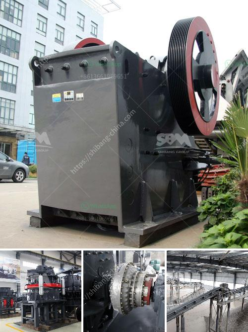

<h3>balls for mining mill</h3>
In the vast world of mining, achieving optimum productivity and efficiency is crucial for the success and profitability of mining operations. Mining mills play a pivotal role in the processing of minerals and ores, grinding them down to desired sizes for downstream processes. One key element for achieving optimal mill performance is the selection of appropriate balls for grinding media. The type, composition, and quality of balls used significantly impact the overall efficiency, productivity, and cost-effectiveness of the mining mill. This article explores the importance of ball selection and its impact on mining mill operations.

Grinding balls, also known as grinding media, are essential components for milling activities in mining mills. These balls are primarily responsible for breaking down the mined materials, such as minerals and ores, into smaller particles through the process of abrasion and impact. The efficiency of this grinding process greatly depends on the quality and characteristics of the grinding balls.

Different types of grinding balls are available, each with distinct material compositions. For example, high chrome casting balls, forged steel balls, or ceramic balls. The material composition chosen depends on factors such as the minerals being ground, the desired particle size, and the mill's operating conditions.

Choosing the right ball size is critical for achieving the desired milling outcomes. Smaller balls are ideal for fine grinding, while larger balls are effective for coarse grinding. Using an appropriate range of ball sizes enables efficient particle size reduction.

The hardness and wear resistance of the grinding balls are key factors in their performance and lifespan. A harder ball can withstand high impact forces, improving grinding efficiency and reducing wear. Innovative technologies, such as heat treatment processes, can enhance the hardness and wear resistance of grinding balls.

The selection of appropriate grinding balls can significantly impact the overall efficiency and productivity of mining mills. Proper ball selection leads to improved size reduction, reduced overgrinding, and enhanced mill capacity. High-quality grinding balls also reduce energy consumption and decrease downtime due to ball replacement.

While the initial cost of high-quality grinding balls may be higher, they provide significant long-term savings. High-quality balls display superior wear resistance, resulting in extended ball lifespans, reduced ball consumption, and lower overall maintenance costs. Investing in premium grinding media can result in remarkable cost savings in the long run.

Choosing grinding balls manufactured using eco-friendly and sustainable practices aligns with the growing importance of environmental consciousness within the mining industry. Opting for recyclable materials and energy-efficient manufacturing processes minimizes environmental impact without compromising performance.

The significance of ball selection in mining mills cannot be overstated. By carefully considering factors such as material composition, ball size, hardness, and wear resistance, mining operations can enhance their overall efficiency, productivity, and cost-effectiveness. Investing in high-quality grinding balls not only maximizes mill performance but also contributes to sustainable practices. Continued research and development in ball technology will undoubtedly drive further optimization in mining mill operations, delivering long-term benefits for the mining industry as a whole.
<h3>Contact us</h3><ul><li><strong>Whatsapp:&nbsp;<a href="https://wa.me/8613661969651">+8613661969651</a></strong></li><li><a href="https://swt.shibang-china.com/?git&amp;zhl&amp;balls for mining mill"><strong>Online Service(chat now)</strong></a></li></ul><h3>Related</h3><ul><li><a href='powder mill machinery process pdf.md'>powder mill machinery process pdf</a></li><li><a href='mobile jaw crusher tons per hour.md'>mobile jaw crusher tons per hour</a></li><li><a href='sand mining for construction in equatorial guinea.md'>sand mining for construction in equatorial guinea</a></li><li><a href='cutting milling machine for marble and granite.md'>cutting milling machine for marble and granite</a></li><li><a href='dolomite crusher price.md'>dolomite crusher price</a></li></ul>