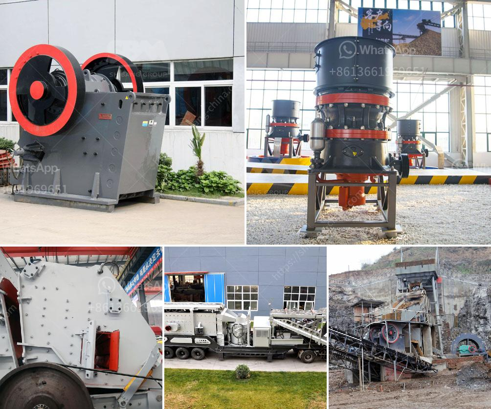

<h3>barite mill cost</h3>
Barite is a versatile industrial mineral that is used in a wide range of applications. It is a weighting agent in drilling fluids, a pigment in paints, and a filler in rubber and plastics. The demand for barite has been growing steadily over the years, resulting in an increased need for barite mills.

When it comes to setting up a barite mill, one of the critical factors to consider is the cost involved. The cost of a barite mill depends on several factors, including the size of the facility, the location, and the equipment used. This article will explore these factors to provide a better understanding of the cost implications.

1. Size of the Facility: The size of the barite mill is one of the primary factors that influence its cost. Larger mills require more space, more capital investment, and higher operating costs. The production capacity of the mill also plays a significant role in determining the cost. A high-capacity mill will have higher upfront costs but can yield higher profits in the long run.

2. Location: The location of the barite mill is another factor that affects its cost. The cost of land or leasing a suitable location can vary significantly depending on the region. Additionally, the transportation costs for raw materials and finished products should also be considered. A mill located close to the source of barite can save on transportation costs, making it more cost-effective.

3. Equipment: The type and quality of equipment used in the barite mill have a direct impact on its cost. The initial investment in machinery and technology can be substantial. It is crucial to choose reliable and efficient equipment to ensure smooth operations and minimize maintenance costs. Additionally, the cost of spare parts and the energy consumption of the equipment should also be taken into account.

4. Labor and Operational Costs: The labor and operational costs associated with running a barite mill are another significant component of the overall cost. Skilled labor is required to operate the equipment and oversee the production process. In addition to wages, other operational expenses, such as utilities, maintenance, and administrative costs, should be factored in to determine the total cost of running the mill.

5. Regulatory Compliance: Compliance with local regulations and environmental standards can also add to the cost of setting up and operating a barite mill. Environmental permits, waste management systems, and pollution control measures can increase the initial investment and ongoing operational expenses. It is essential to budget for these aspects to ensure compliance and avoid penalties.

In conclusion, the cost of setting up and operating a barite mill depends on several factors, including the size of the facility, location, equipment, labor, and regulatory compliance. All these factors should be carefully considered and evaluated to determine the total cost. A thorough cost analysis will help potential investors make informed decisions and assess the profitability of a barite mill project.
<h3>Contact us</h3><ul><li><strong>Whatsapp:&nbsp;<a href="https://wa.me/8613661969651">+8613661969651</a></strong></li><li><a href="https://swt.shibang-china.com/?git&amp;zhl&amp;barite mill cost"><strong>Online Service(chat now)</strong></a></li></ul><h3>Related</h3><ul><li><a href='rock crushing machine for concrete use.md'>rock crushing machine for concrete use</a></li><li><a href='largest quarry machine manufacturer.md'>largest quarry machine manufacturer</a></li><li><a href='how much cost to buildton cement plant.md'>how much cost to buildton cement plant</a></li><li><a href='iron ore beneficiation technology.md'>iron ore beneficiation technology</a></li><li><a href='mini mobile crusher plant for sale.md'>mini mobile crusher plant for sale</a></li></ul>