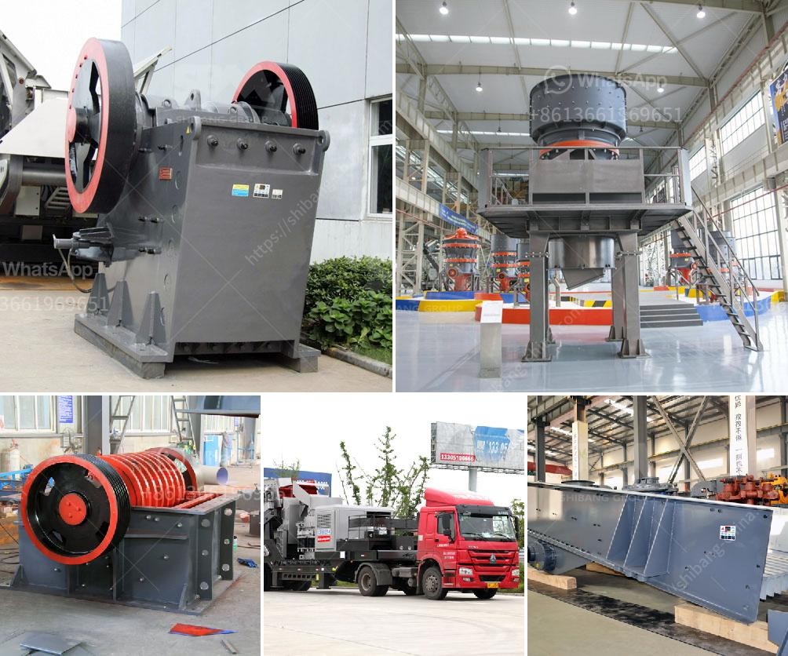

<h3>barite mining crusher in nigeria</h3>
Barite mineral is one of the main resources for petroleum exploration and development in Nigeria. It is a vital component in drilling mud, which is used in the drilling of oil and gas wells. This mineral is also used as a filler material in various industries, such as plastics, paint, rubber, and glass.

Nigeria has abundant mineral resources, of which barite is one of them. Barite deposit in Nigeria is estimated to be about 41 million metric tonnes. The demand for barite in the oil and gas industry is high, and it is expected to increase significantly in the coming years.

To meet the demand, Nigeria Barite Mining and Processing Company Ltd. was incorporated in 1985. The company has been involved in the exploration, development, and production of barite resources in Nigeria.

The mining equipment used for barite production mainly includes crusher, vibrating screen, jigging machine, and dewatering screen, etc. In the process of crushing, Zenith uses jaw crusher and applies two-stage crushing process. In the process of screening, ZENITH uses simple and useful circular vibrating screen, which also plays a role in dust suppression.

Barite mining in Nigeria can create economic benefits. The country has huge deposits of oil and gas reserves, making it one of the economic powerhouses in Africa. The mining and processing of barite further contributes to the country's revenue by providing jobs and promoting the industry's development.

However, there are concerns about the environmental impact of barite mining in Nigeria. The extraction of barite often leads to deforestation, soil erosion, and pollution of nearby water bodies. It is crucial for the government and mining companies to take necessary measures to minimize the negative impacts and promote sustainable mining practices.

In conclusion, barite mining in Nigeria plays a crucial role in the country's economy and development. As the demand for barite continues to grow, it is essential to ensure responsible mining practices to mitigate the environmental impact and maximize the economic benefits. By adopting sustainable mining practices, Nigeria can harness the potential of its abundant barite resources while protecting the environment for future generations.
<h3>Contact us</h3><ul><li><strong>Whatsapp:&nbsp;<a href="https://wa.me/8613661969651">+8613661969651</a></strong></li><li><a href="https://swt.shibang-china.com/?git&amp;zhl&amp;barite mining crusher in nigeria"><strong>Online Service(chat now)</strong></a></li></ul><h3>Related</h3><ul><li><a href='cost 100tpd cement plant india.md'>cost 100tpd cement plant india</a></li><li><a href='price of stone crusher capacity 200 tons per hour.md'>price of stone crusher capacity 200 tons per hour</a></li><li><a href='enquiry about rock crusher.md'>enquiry about rock crusher</a></li><li><a href='what is the best granite crusher machine.md'>what is the best granite crusher machine</a></li><li><a href='granite edge cutting machine in sweden.md'>granite edge cutting machine in sweden</a></li></ul>