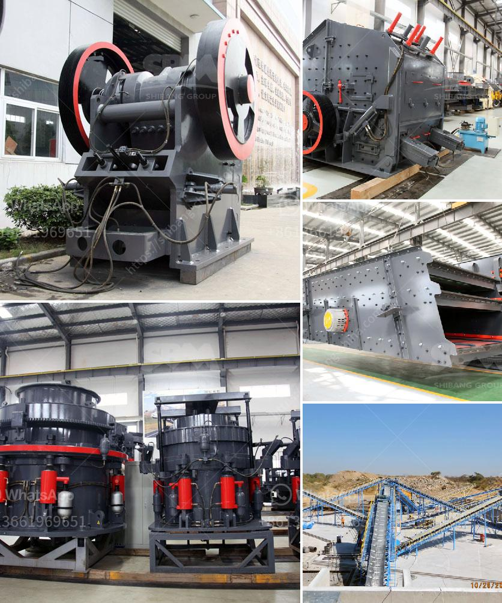

<h3>barite mining process</h3>
Barite, commonly known as baryte, is a mineral with a high specific gravity and is the primary ore of barium. Its usage dates back to the ancient Egyptians who used it to make a variety of pigments for pottery, textiles, and paintings. Today, barite continues to be in high demand primarily in the oil and gas industry due to its unique properties.

The process of extracting barite involves a series of steps. First, the ore-bearing rocks are blasted and partially crushed. Upon excavation, the next step is to separate the ore from the waste rock using various concentration methods. The resulting concentrate is then ground into a fine powder to extract the desired barite.

Gravity separation is a common method to extract barite. A jig machine uses pulsating water to separate dense barite from low-density rock particles. The heavier barite settles at the bottom of the jig while the lighter waste material is carried away. This process is repeated several times to ensure a high-grade concentrate.

Flotation is another method used to extract barite. In this process, chemicals are added to the ground barite powder to make it hydrophobic. Air bubbles are then injected into the mixture to float the barite to the surface, leaving the waste material behind.

After the barite is separated, it undergoes further processing to remove impurities and ensure the desired quality. This includes drying the powder, crushing it into specific sizes, and performing chemical treatments if necessary.

However, the mining of barite is not without environmental concerns. This process can result in the disturbance of land, deforestation, and alteration of natural habitats. Additionally, the waste generated during the mining process can have negative impacts on nearby water sources if not properly managed.

To mitigate these concerns, responsible mining practices are crucial. This includes proper land restoration, effective waste management, and compliance with environmental regulations. Moreover, ongoing research and development efforts are focused on making the mining process more sustainable and reducing its overall environmental impact.

In conclusion, the mining process of barite involves various steps to extract and refine the mineral into its desired form. It is a vital resource for various industries, particularly the oil and gas sector. However, careful consideration and implementation of environmentally responsible practices are necessary to minimize any negative impact on the environment.
<h3>Contact us</h3><ul><li><strong>Whatsapp:&nbsp;<a href="https://wa.me/8613661969651">+8613661969651</a></strong></li><li><a href="https://swt.shibang-china.com/?git&amp;zhl&amp;barite mining process"><strong>Online Service(chat now)</strong></a></li></ul><h3>Related</h3><ul><li><a href='crushing machine manufacturer in maharashtra.md'>crushing machine manufacturer in maharashtra</a></li><li><a href='dealer of vibrating screen philippines.md'>dealer of vibrating screen philippines</a></li><li><a href='stone crusher manufacturers in ludhiana.md'>stone crusher manufacturers in ludhiana</a></li><li><a href='minerals separation and concentration plant in nigeria.md'>minerals separation and concentration plant in nigeria</a></li><li><a href='coal crusher buyer in philippines.md'>coal crusher buyer in philippines</a></li></ul>