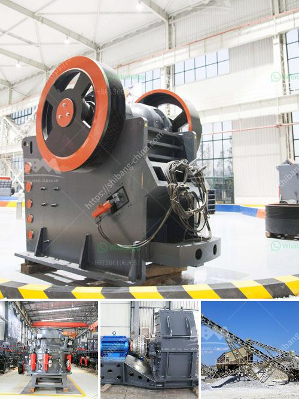

<h3>barite powder manufacturing plant</h3>
Barite, or barium sulfate, is a mineral that has gained popularity in various industries over the years due to its diverse range of applications. It is commonly used as a weighting agent in drilling muds for oil and gas exploration, as well as a pigment in paints, plastics, and paper manufacturing. With such a wide range of uses, the demand for high-quality barite powder has increased significantly, prompting the need for barite powder manufacturing plants.

A barite powder manufacturing plant is a facility designed to produce high-quality barite powder. It is typically equipped with specialized machinery and equipment that can efficiently grind barite into fine powder and package it for commercial use. The main components of a barite powder manufacturing plant include crushers, grinding mills, conveyors, dust collectors, and storage silos.

The manufacturing process begins with the extraction of barite ore from the earth's crust. The ore is then crushed and ground to achieve the desired particle size. This is accomplished using crushers and grinding mills, which reduce the ore into smaller fragments. The finely ground ore is then passed through a series of sieves to separate the desired particle size.

Once the barite ore has been ground to the desired particle size, it is transferred to storage silos or hoppers. From there, it can be transported to the packaging area. In the packaging area, the barite powder is weighed and packaged into bags or other containers for shipment.

One of the key advantages of a barite powder manufacturing plant is its ability to produce high-quality products consistently. The specialized machinery and equipment used in these plants are designed to achieve precise grinding and sizing, ensuring that the final product meets the required specifications. This is crucial for industries that rely on barite powder as a raw material, as any variation in quality can negatively impact the performance of their products.

Moreover, a barite powder manufacturing plant offers several economic benefits. By producing barite powder locally, companies can reduce transportation costs and shorten lead times, improving their competitiveness in the market. Additionally, these plants create job opportunities in the local community, contributing to economic growth and development.

In conclusion, a barite powder manufacturing plant is a crucial facility in the production of high-quality barite powder. With its ability to efficiently grind and package barite ore, it serves as a solution for industries that require consistent and high-quality barite products. The presence of such plants not only ensures a reliable supply of barite powder but also offers economic benefits to the local community. As the demand for barite powder continues to grow, the establishment of more manufacturing plants will play a crucial role in meeting this demand and supporting various industries worldwide.
<h3>Contact us</h3><ul><li><strong>Whatsapp:&nbsp;<a href="https://wa.me/8613661969651">+8613661969651</a></strong></li><li><a href="https://swt.shibang-china.com/?git&amp;zhl&amp;barite powder manufacturing plant"><strong>Online Service(chat now)</strong></a></li></ul><h3>Related</h3><ul><li><a href='linear vibrating screener nigeria.md'>linear vibrating screener nigeria</a></li><li><a href='aggregate production equipment.md'>aggregate production equipment</a></li><li><a href='estimated budget for a conveyor belt.md'>estimated budget for a conveyor belt</a></li><li><a href='small ore crusher.md'>small ore crusher</a></li><li><a href='talc powder mill suppliers in china.md'>talc powder mill suppliers in china</a></li></ul>