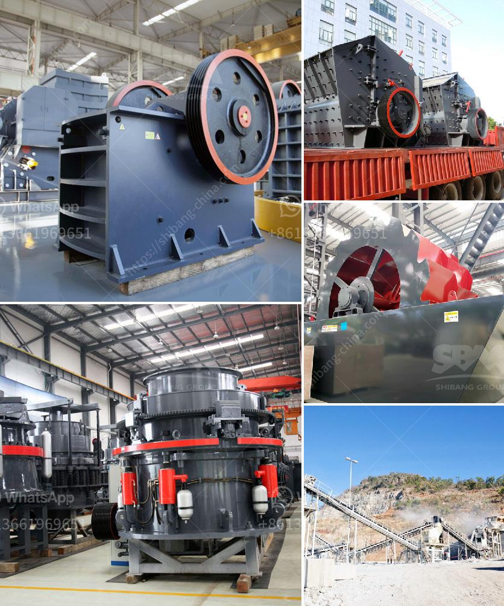

<h3>barite powder production process</h3>
Barite, or barium sulfate, is a mineral that is primarily used as a weighting agent in drilling fluids for oil and gas wells. Barite powder is also used as a filler in various industries, including paints, plastics, rubber, and ceramics. The production of barite powder involves several steps, including mining, crushing, grinding, and purification.

Barite is mined from the earth's crust and is extracted through both open-pit and underground mining methods. It is typically found in sedimentary rocks, such as limestone, and is often associated with minerals like celestine and fluorite. The mining process begins with the extraction of the ore from the ground, which is then transported to the processing plant.

After the barite ore is mined, it must undergo crushing to reduce the size of the particles for further processing. This is typically done using crushers, which can reduce the ore into smaller fragments. The crushed ore is then transported to a grinding mill for further size reduction.

Once the barite ore has been crushed, it is then ground into a fine powder in a grinding mill. The grinding process can be either wet or dry, depending on the desired fineness of the powder and the specific requirements of the application. In the grinding mill, the barite ore is ground into a powder, which can range from 200 to 325 mesh.

To ensure the quality of the barite powder, it must undergo a purification process. This involves removing impurities, such as silica, iron oxide, and carbonates, through various methods. One common method is the use of flotation, where chemicals are added to the ground barite powder to separate it from impurities. The purified barite powder is then dried and packaged for distribution.

Throughout the entire production process, quality control measures are implemented to ensure that the barite powder meets the required specifications. This includes regular testing of the ore, intermediate products, and final powder for various physical and chemical properties. Closely monitoring and controlling the production parameters, such as grinding time, temperature, and concentration, are essential to producing high-quality barite powder.

In conclusion, the production of barite powder involves several stages, including mining, crushing, grinding, and purification. These processes are necessary to produce a high-quality powder suitable for various industries. By closely monitoring the production parameters and implementing strict quality control measures, manufacturers can ensure the consistency and purity of the barite powder, making it a valuable commodity in a wide range of applications.
<h3>Contact us</h3><ul><li><strong>Whatsapp:&nbsp;<a href="https://wa.me/8613661969651">+8613661969651</a></strong></li><li><a href="https://swt.shibang-china.com/?git&amp;zhl&amp;barite powder production process"><strong>Online Service(chat now)</strong></a></li></ul><h3>Related</h3><ul><li><a href='primary stone crusher.md'>primary stone crusher</a></li><li><a href='mobile recycle crushing.md'>mobile recycle crushing</a></li><li><a href='conveyor belts for shelves.md'>conveyor belts for shelves</a></li><li><a href='washing plant suppliers in mozambique.md'>washing plant suppliers in mozambique</a></li><li><a href='picture of silica sand process plant.md'>picture of silica sand process plant</a></li></ul>