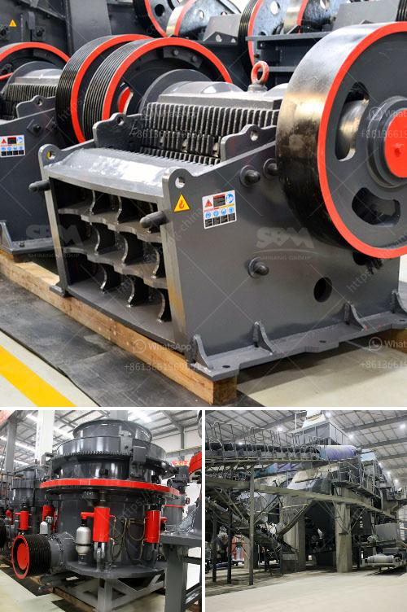

<h3>barite processing plant information</h3>
Barite, or barium sulfate, is a mineral commonly found in nature. It has a high specific gravity, making it ideal for a wide range of industrial applications, including oil drilling, paint and pigment manufacturing, and medical imaging. To meet the growing demand for barite, various mining companies have established barite processing plants, which process crude barite into more refined forms.

One of the most common methods used to process barite is gravity separation. This involves crushing the crude barite ore into smaller particles and then suspending them in water. Gravity separation relies on the differences in density between barite and other minerals to separate them. The heavier barite particles settle at the bottom of the suspension, while the lighter particles are carried away by water.

After gravity separation, the barite ore undergoes further processing to remove impurities and improve its quality. This may include additional grinding to achieve the desired particle size, as well as magnetic separation to remove magnetic minerals. Sometimes, froth flotation is also used to remove certain impurities.

Once the barite ore has been processed, it is then ready for various industrial applications. In the oil drilling industry, barite is added to drilling mud to increase its density. This helps to stabilize the borehole, prevent blowouts, and lubricate the drilling tools. Barite is also used in the manufacturing of paint and pigments, where it acts as a filler and extender to improve the color, opacity, and durability of the final product. In medical imaging, barium sulfate suspensions are used to highlight the gastrointestinal tract during X-ray exams.

Barite processing plants are typically located in areas with abundant barite resources. This ensures a steady supply of raw material, reducing the need for transportation. The choice of location also depends on factors such as proximity to customers and access to infrastructure, such as ports and roads.

Although barite processing plants can have a significant impact on the local environment, modern facilities are designed to minimize these effects. They employ various environmental protection measures, such as dust control systems, wastewater treatment facilities, and noise reduction strategies. Additionally, regulations and guidelines are in place to ensure that the operations are carried out in a responsible manner.

The establishment of barite processing plants has contributed to local economies by creating job opportunities and attracting investment. These plants not only produce value-added products but also generate revenue through the export of barite to international markets. Furthermore, the utilization of barite in various industries enhances overall industrial productivity and economic growth.

In conclusion, barite processing plants play a crucial role in the production of this versatile mineral. By processing crude barite and refining it into high-quality products, these facilities meet the growing demand for barite in various industries. With their focus on environmentally sustainable practices and their contribution to local economies, barite processing plants are an integral part of the industrial landscape.
<h3>Contact us</h3><ul><li><strong>Whatsapp:&nbsp;<a href="https://wa.me/8613661969651">+8613661969651</a></strong></li><li><a href="https://swt.shibang-china.com/?git&amp;zhl&amp;barite processing plant information"><strong>Online Service(chat now)</strong></a></li></ul><h3>Related</h3><ul><li><a href='mobile impact crusher in road construction.md'>mobile impact crusher in road construction</a></li><li><a href='bauxite ore business plan pdf.md'>bauxite ore business plan pdf</a></li><li><a href='silica quartz crushing plant.md'>silica quartz crushing plant</a></li><li><a href='alluvial diamond processing plant cost.md'>alluvial diamond processing plant cost</a></li><li><a href='manufacturer of industrial hammer mill.md'>manufacturer of industrial hammer mill</a></li></ul>