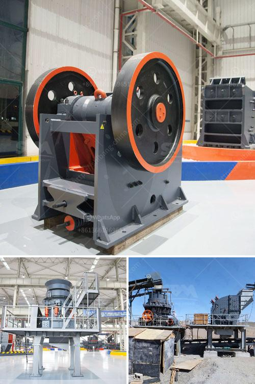

<h3>barite production lines manufacturers</h3>
Barite is a mineral that is commonly used in various industries such as oil and gas, paint, and pharmaceuticals. It is a crucial ingredient in the production of drilling mud and is also used as a weighting agent in other applications. As the demand for barite continues to increase, so does the need for efficient production lines and reliable manufacturers.

Barite production lines consist of a set of machines designed to process and grind barite ore into desired particle sizes. These machines include crushers, vibrating screens, conveyors, and grinding mills. The final product obtained after processing is a finely ground powder that meets the specifications required by the end-users.

There are several manufacturers of barite production lines in the market, each offering their unique set of machines and expertise. These manufacturers play a vital role in meeting the growing demands of the barite industry. They strive to provide high-quality equipment that is technologically advanced, efficient, and durable.

One such reputable manufacturer is XYZ Machinery. With years of experience in the manufacturing industry, XYZ Machinery has gained a strong reputation for delivering state-of-the-art barite production lines. They employ advanced technology and innovative design principles to offer machinery that maximizes productivity while minimizing energy consumption.

XYZ Machinery's barite production lines are known for their high output capacity, allowing for large-scale processing of barite ore. Their crushers are designed to break down the ore into smaller, manageable sizes, while the vibrating screens efficiently separate the particles based on their size. The conveyors then transport the processed material to the grinding mills, where it is further reduced to the desired particle size.

The grinding mills provided by XYZ Machinery are equipped with advanced grinding mechanisms that ensure precise and consistent results. These mills are designed to handle a wide range of barite ore and can produce different grades of barite powder depending on the end-users' requirements. The finished powder is carefully quality tested to ensure it meets the necessary specifications for various applications.

In addition to their top-of-the-line machinery, XYZ Machinery offers comprehensive after-sales services to their customers. They provide installation support, training programs for operators, and regular maintenance services to ensure that the machinery remains in optimal condition throughout its lifespan. Their dedicated customer service team is always available to address any concerns or provide technical assistance when needed.

Choosing a reliable and reputable manufacturer of barite production lines is crucial for businesses in the barite industry. XYZ Machinery stands out among competitors due to their commitment to delivering high-quality equipment, advanced technology, and excellent customer support. By partnering with XYZ Machinery, companies can enhance their production capabilities, meet growing demands, and ensure the consistent supply of high-quality barite products.

In conclusion, the demand for barite continues to rise, leading to an increased need for efficient production lines. Manufacturers like XYZ Machinery play a vital role in meeting this demand by providing advanced equipment designed to process barite ore into finely ground powder. Their state-of-the-art machinery, combined with comprehensive after-sales services, makes them a trusted choice for businesses in the barite industry.
<h3>Contact us</h3><ul><li><strong>Whatsapp:&nbsp;<a href="https://wa.me/8613661969651">+8613661969651</a></strong></li><li><a href="https://swt.shibang-china.com/?git&amp;zhl&amp;barite production lines manufacturers"><strong>Online Service(chat now)</strong></a></li></ul><h3>Related</h3><ul><li><a href='how many kg in 1 cubic feet of 20mm crusher stone.md'>how many kg in 1 cubic feet of 20mm crusher stone</a></li><li><a href='silica sand crusher machine.md'>silica sand crusher machine</a></li><li><a href='copper concentrate ball mill for sale.md'>copper concentrate ball mill for sale</a></li><li><a href='price of a stone crusher.md'>price of a stone crusher</a></li><li><a href='machinery for starch plant japan.md'>machinery for starch plant japan</a></li></ul>