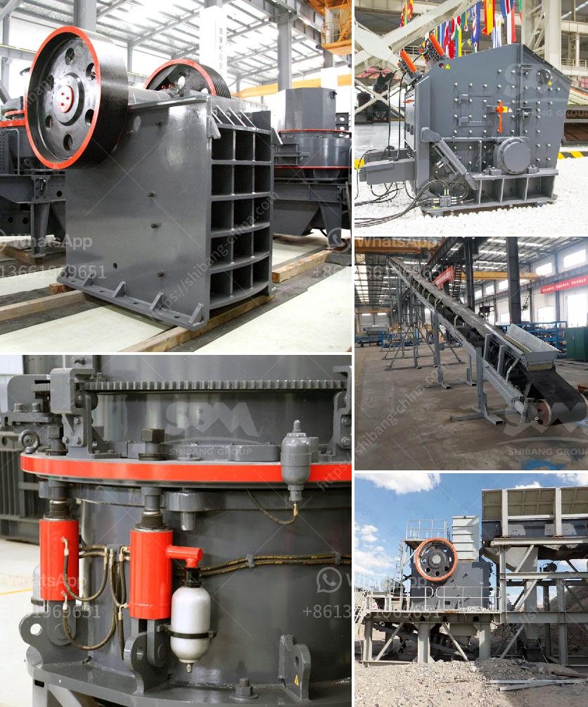

<h3>barium powder production machine</h3>
Barium powder is a versatile and essential substance used in various industries such as pharmaceuticals, textiles, and petroleum. Its ability to enhance product performance and offer unique properties has made it an integral part of several manufacturing processes. To meet the rising demand for barium powder, manufacturers are adopting advanced production machines that ensure efficient and high-quality output.

The barium powder production machine is a groundbreaking innovation that has revolutionized the manufacturing process. With its advanced technology and precision engineering, it provides a seamless and streamlined production process, resulting in consistent and reliable quality.

One of the key features of the barium powder production machine is its ability to produce a wide range of particle sizes. This flexibility allows manufacturers to customize the powder according to specific requirements, ensuring optimum performance in end products. Additionally, the machine's precise control over particle size distribution guarantees a uniform and consistent powder that meets industry standards.

Another crucial aspect of the barium powder production machine is its energy-efficient design. The machine operates with minimal energy consumption, reducing production costs and minimizing its environmental impact. Furthermore, its automated system ensures efficient use of raw materials, resulting in reduced wastage and increased overall productivity.

Safety is a paramount concern in any manufacturing process, and the barium powder production machine addresses this with utmost importance. It incorporates cutting-edge safety features, such as an enclosed system that prevents leakage and contamination. Additionally, the machine's automated processes minimize the need for human intervention, reducing the risk of accidents and ensuring a safe working environment.

In conclusion, the barium powder production machine is a game-changer in the powder manufacturing industry. Its advanced technology, customizable particle sizes, energy efficiency, and safety features make it an indispensable asset for manufacturers. With its ability to deliver high-quality and consistent output, this machine is not only boosting productivity but also enhancing product performance across various industries. As the demand for barium powder continues to rise, the barium powder production machine remains at the forefront of innovation, providing manufacturers with a reliable and efficient solution.
<h3>Contact us</h3><ul><li><strong>Whatsapp:&nbsp;<a href="https://wa.me/8613661969651">+8613661969651</a></strong></li><li><a href="https://swt.shibang-china.com/?git&amp;zhl&amp;barium powder production machine"><strong>Online Service(chat now)</strong></a></li></ul><h3>Related</h3><ul><li><a href='ball mills for 6 x 6 mining.md'>ball mills for 6 x 6 mining</a></li><li><a href='mobile crusher for salt.md'>mobile crusher for salt</a></li><li><a href='used crusher rock mining germany.md'>used crusher rock mining germany</a></li><li><a href='stone crusher machine assembling flow chart.md'>stone crusher machine assembling flow chart</a></li><li><a href='basalt mining crusher.md'>basalt mining crusher</a></li></ul>