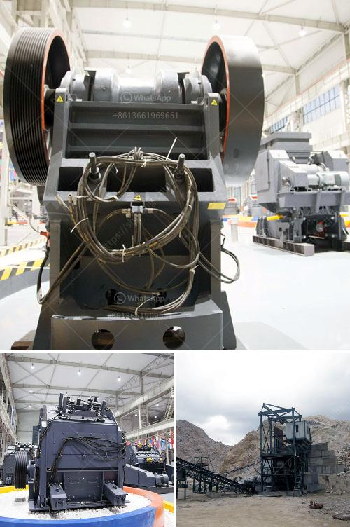

<h3>basalt mining crusher</h3>
Basalt, the hard and dense volcanic rock, is the most common plutonic rock found on Earth's surface. It is widely used in construction, manufacturing, and landscaping due to its durability and attractive appearance. To supply the growing demand, the mining industry has developed a solution in the form of the basalt mining crusher.

The basalt mining crusher is an essential piece of equipment in mining operations mainly for crushing stones. With the continuous advancement of technology, the crusher has evolved and become more versatile and efficient. Today, it is one of the key pieces of equipment in large-scale mining operations.

One of the main advantages of the basalt mining crusher is its excellent ability to crush various materials from large sizes to fine sand particles. This makes it perfect for producing high-quality aggregates for construction projects. Additionally, its powerful crushing capacity enables it to handle even the toughest materials, including basalt.

The basalt mining crusher is typically used as a primary crusher in the crushing process. It plays a vital role in the process of basalt breaking. It is widely used in basalt crushing operations for its advantages such as high crushing efficiency, low operating cost, large crushing ratio, and high-quality finished products.

After the basalt is crushed, it can be used as raw material in various fields, such as construction, building materials, railways, and roads. In addition, basalt can also be used in the production of fiber materials such as rock wool and basalt fiber, which have excellent insulation and heat resistance properties.

The basalt mining crusher also plays a crucial role in mining operations. It enables the extraction of valuable minerals from the ore body efficiently. Additionally, it helps in reducing the size of the ore before further processing, increasing the overall productivity of the mining operation.

In terms of environmental impact, the basalt mining crusher offers several advantages. As a natural resource, basalt is abundant and widely distributed, minimizing the need for excessive mining activities. Furthermore, once the basalt is mined, it can be recycled and reused, reducing waste and conserving resources. Lastly, the by-products of basalt mining, such as basalt dust, can be used in various applications, such as fertilizers and soil amendments.

To conclude, the basalt mining crusher is a valuable asset in the mining industry. Its ability to crush various materials efficiently and its versatility make it an essential piece of equipment in large-scale mining operations. Additionally, it offers several environmental advantages, such as resource conservation and waste reduction. With the continued advancement of technology, the basalt mining crusher will only become more efficient and indispensable in the mining industry.
<h3>Contact us</h3><ul><li><strong>Whatsapp:&nbsp;<a href="https://wa.me/8613661969651">+8613661969651</a></strong></li><li><a href="https://swt.shibang-china.com/?git&amp;zhl&amp;basalt mining crusher"><strong>Online Service(chat now)</strong></a></li></ul><h3>Related</h3><ul><li><a href='flow chart for gold extraction from ores.md'>flow chart for gold extraction from ores</a></li><li><a href='machinery conveyor belts.md'>machinery conveyor belts</a></li><li><a href='technical specification for ball mill.md'>technical specification for ball mill</a></li><li><a href='limestone crusher for sale.md'>limestone crusher for sale</a></li><li><a href='300 tph jaw crusher.md'>300 tph jaw crusher</a></li></ul>