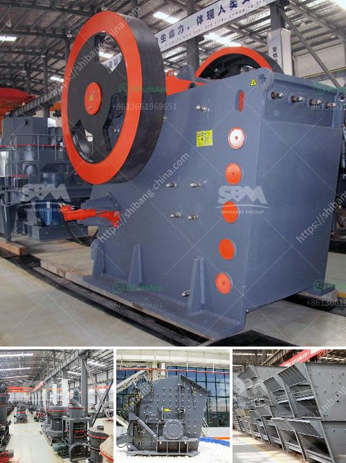

<h3>basic process in producing clay products</h3>
The production of clay products is a fascinating process that involves several basic steps. From the extraction of clay from the earth to the final firing of the product, every stage contributes to creating unique and beautiful clay creations.

The first step in producing clay products is the extraction of clay from the earth. Clay is typically found in areas where there has been volcanic activity or the deposit of sediment in bodies of water. The clay is usually mined or extracted using heavy machinery and then brought to the production facility.

Once the clay is extracted, it goes through a process known as clay preparation. This involves removing impurities and foreign materials from the clay to ensure its quality and workability. The clay is mixed with water to form a slurry and then passed through screens and filters to remove any debris, rocks, or organic matter.

After preparing the clay, it is ready for shaping. The most common method used is molding, where the clay is shaped into the desired form. This can be done by hand or using molds and tools, depending on the complexity of the product. Skilled artisans use their experience and creativity to bring life to the clay, turning it into functional or decorative objects.

Once the clay product is shaped, it goes through a drying process to remove any remaining moisture. This is typically done slowly and evenly to prevent cracking or warping. The drying time can vary depending on the size and thickness of the clay object.

After drying, the clay product is ready for firing. Firing is the process of heating the clay at high temperatures to strengthen it and make it durable. There are two main types of firing: bisque firing and glaze firing. Bisque firing is done first to harden the clay, followed by glaze firing to add a protective and decorative layer.

Finally, the clay product is cooled and inspected for any defects or imperfections. It is then ready to be packaged and shipped to its final destination.

In conclusion, the production of clay products involves several critical steps, from clay extraction to final firing. Each step requires skill, knowledge, and attention to detail to ensure the creation of high-quality and visually appealing clay products. Whether it is a simple vase or an intricate sculpture, the process remains the same, making clay production a true art form.
<h3>Contact us</h3><ul><li><strong>Whatsapp:&nbsp;<a href="https://wa.me/8613661969651">+8613661969651</a></strong></li><li><a href="https://swt.shibang-china.com/?git&amp;zhl&amp;basic process in producing clay products"><strong>Online Service(chat now)</strong></a></li></ul><h3>Related</h3><ul><li><a href='mobile crusher namibia.md'>mobile crusher namibia</a></li><li><a href='mobile impact crusher in road construction.md'>mobile impact crusher in road construction</a></li><li><a href='usine carbonate de calcium.md'>usine carbonate de calcium</a></li><li><a href='mobile crushers for sale ghana.md'>mobile crushers for sale ghana</a></li><li><a href='production process of cement.md'>production process of cement</a></li></ul>