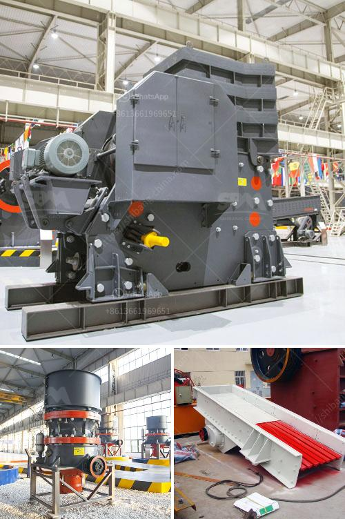

<h3>bauxite manufacture equipment in india</h3>
Bauxite is the primary ore from which aluminum is extracted. In India, bauxite is mainly found in Jharkhand, Odisha, Madhya Pradesh, Gujarat, and Maharashtra. The mining and manufacturing of bauxite require specialized equipment to ensure efficient extraction and processing.

India is one of the largest producers of bauxite in the world. The country's bauxite reserves, estimated at 3,900 million tons, are immense. However, the mining industry in India faces challenges related to environmental regulations and sustainable practices. To overcome these challenges, manufacturers in the country have developed advanced equipment for bauxite mining and processing.

The key equipment required for bauxite manufacturing in India includes crushers, grinders, feeders, screens, washers, conveyors, and rotary kilns. These equipment help in efficient crushing, grinding, washing, separation, and drying of the bauxite ore. Crushers and grinders are used to break down the ore into smaller particles for easier processing. Screens and feeders are used to ensure proper material handling and uniform size distribution.

Once the bauxite ore is processed, it needs to be washed to remove impurities and dried to achieve the desired moisture content. Specialized washers and dryers are used for this purpose. Conveyors are also an essential part of the bauxite manufacturing process, as they help in transporting the ore to different stages of processing.

Rotary kilns play a crucial role in the final stage of bauxite processing, where the ore is converted into alumina through a process called calcination. The kilns are maintained at high temperatures, allowing the chemical reactions to occur, resulting in the formation of alumina.

Several manufacturers in India provide bauxite manufacturing equipment, including renowned companies like Metso Outotec, FLSmidth, and Thyssenkrupp Industries. These companies offer state-of-the-art technology and equipment to ensure efficient and sustainable bauxite mining and manufacturing processes.

In conclusion, India possesses vast bauxite reserves and is a major producer of aluminum globally. The efficient extraction and processing of bauxite require specialized equipment, which is readily available in the Indian market. The adoption of advanced equipment promotes sustainable practices and ensures the responsible use of natural resources, further strengthening India's position as a leading bauxite manufacturer.
<h3>Contact us</h3><ul><li><strong>Whatsapp:&nbsp;<a href="https://wa.me/8613661969651">+8613661969651</a></strong></li><li><a href="https://swt.shibang-china.com/?git&amp;zhl&amp;bauxite manufacture equipment in india"><strong>Online Service(chat now)</strong></a></li></ul><h3>Related</h3><ul><li><a href='how to calculate the cost of returns.md'>how to calculate the cost of returns</a></li><li><a href='cone crusher 100tph prices in india.md'>cone crusher 100tph prices in india</a></li><li><a href='stamp mills for sale in zimbabwe.md'>stamp mills for sale in zimbabwe</a></li><li><a href='grinding mill power.md'>grinding mill power</a></li><li><a href='pulverizer coal with gasifier.md'>pulverizer coal with gasifier</a></li></ul>