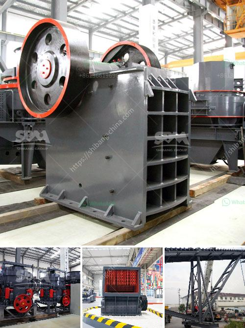

<h3>bauxite ore business plan pdf</h3>
The global demand for aluminum is expected to rise steadily in the coming years, opening up significant opportunities for entrepreneurs in the bauxite ore industry. However, taking advantage of this growth requires a well-defined business plan that outlines strategies, goals, and financial projections. In this article, we will discuss the importance of a bauxite ore business plan PDF and highlight key elements to include within its pages.

A successful business plan begins with a comprehensive understanding of the bauxite ore market. Conduct thorough research on industry trends, market competition, pricing dynamics, and future demand projections. Highlight key target markets, such as construction, automotive, and aerospace industries.

Clearly articulate your company's vision, mission, and values. Describe the ownership structure, management team experience, and unique selling points. Emphasize factors such as sustainable mining practices, state-of-the-art equipment, and established relationships with suppliers, transporters, and potential customers.

Provide a detailed overview of your bauxite ore product, including its quality, quantities available, and specifications. Highlight any competitive advantages, such as high alumina content or low impurities. Discuss how your product meets market demands and quality standards.

Outline your marketing and sales approach to penetrate the market. Highlight target customer segments, distribution channels, and marketing techniques like online advertising, participation in trade fairs, and building relationships with industry influencers. Tailor your marketing message to highlight your product's unique features and competitive pricing.

Detail your mining and processing activities, infrastructure requirements, site selection criteria, and environmental impact assessment. Describe the equipment needed, safety protocols, and the labor force required to operate your mine efficiently. Include plans for ongoing maintenance and regulatory compliance.

Outline your expected revenue, costs, and profit projections. Provide an analysis of the initial investment required, expected cash flow, and return on investment. Include a description of funding sources, potential financing options, and an analysis of the payback period.

The bauxite ore industry presents a lucrative business opportunity given the rising global demand for aluminum. A well-crafted business plan is essential to uncovering the potential of this sector. By developing a bauxite ore business plan PDF that incorporates market analysis, company description, marketing strategy, operational plan, and financial projections, entrepreneurs can position themselves for success in this thriving market.
<h3>Contact us</h3><ul><li><strong>Whatsapp:&nbsp;<a href="https://wa.me/8613661969651">+8613661969651</a></strong></li><li><a href="https://swt.shibang-china.com/?git&amp;zhl&amp;bauxite ore business plan pdf"><strong>Online Service(chat now)</strong></a></li></ul><h3>Related</h3><ul><li><a href='price of copper smelting plant.md'>price of copper smelting plant</a></li><li><a href='mobile crusher prices in philippines.md'>mobile crusher prices in philippines</a></li><li><a href='jaw crusher with production capacity of ton hr.md'>jaw crusher with production capacity of ton hr</a></li><li><a href='quarry screening equipment.md'>quarry screening equipment</a></li><li><a href='vibro feeder price listing south africa.md'>vibro feeder price listing south africa</a></li></ul>