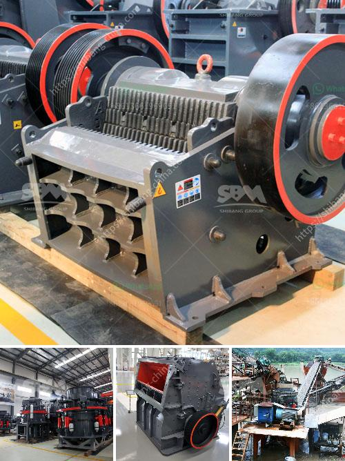

<h3>bauxite ore processing plant for sale</h3>
Bauxite is a widely used material in many industries, including aluminum production, ceramics, refractories, cement, and chemicals. In order to extract usable alumina from bauxite ore, it is necessary to undergo a series of processing steps. Bauxite ore processing plants are known for their high efficiency and low maintenance requirements.

One of the major challenges for bauxite processing plants is the high silica content in the ore. Silica content in bauxite can vary from a few percent to around 50 percent, depending on the deposit. High levels of silica can lead to equipment corrosion, increased energy consumption, and reduced alumina recovery. Therefore, efficient and effective silica removal processes are essential in bauxite ore processing plants.

There are various methods for silica removal, including screening, scrubbing, washing, and flotation. Screening involves separating the bauxite ore into different size fractions, which helps in reducing the silica content. Scrubbing involves the use of rotary or vibrating drum scrubbers to remove clay minerals, which can also contribute to silica content. Washing methods can further wash away impurities, including silica, using water and mechanical agitation.

Flotation is an effective method for the removal of silica from bauxite ore. It involves the use of chemicals to selectively separate silica from the bauxite ore. The chemicals react with the silica, forming a froth that can be easily removed from the slurry. This method is particularly effective when dealing with high-silica bauxite ores.

After the silica removal process, the bauxite ore is subjected to further processing to extract alumina. Alumina, also known as aluminum oxide, is the primary component of aluminum. The Bayer process is the most commonly used method for extracting alumina from bauxite ore. It involves grinding the ore into a fine slurry, then treating it with caustic soda under high temperature and pressure. This process dissolves the alumina content, leaving behind insoluble impurities, which are then separated by settling and filtering.

The final step in bauxite ore processing is the extraction of aluminum metal. This is achieved through the Hall-Héroult process, which involves the electrolytic reduction of alumina in molten cryolite. The process produces aluminum metal and oxygen gas as byproducts.

Bauxite ore processing plants for sale are available in various capacities to suit different production requirements. These plants are typically designed with advanced technology and equipment to ensure high efficiency and low operating costs. They are also equipped with modern control systems to monitor and optimize the processing parameters. Furthermore, these plants are often designed with environmental considerations in mind, incorporating measures to minimize waste and emissions.

In conclusion, bauxite ore processing plants play a crucial role in extracting usable alumina from bauxite ore. These plants employ various methods to remove impurities and extract alumina, ultimately leading to the production of aluminum metal. Bauxite ore processing plants for sale offer efficient and cost-effective solutions for bauxite processing, making them a valuable investment for industries that rely on aluminum production.
<h3>Contact us</h3><ul><li><strong>Whatsapp:&nbsp;<a href="https://wa.me/8613661969651">+8613661969651</a></strong></li><li><a href="https://swt.shibang-china.com/?git&amp;zhl&amp;bauxite ore processing plant for sale"><strong>Online Service(chat now)</strong></a></li></ul><h3>Related</h3><ul><li><a href='raymond mills mexico.md'>raymond mills mexico</a></li><li><a href='jaw crusher philippines 50 tons per day.md'>jaw crusher philippines 50 tons per day</a></li><li><a href='omya calcium carbonate grinding technology.md'>omya calcium carbonate grinding technology</a></li><li><a href='stone crusher 50tons per hour.md'>stone crusher 50tons per hour</a></li><li><a href='rock crushing plants for sale.md'>rock crushing plants for sale</a></li></ul>