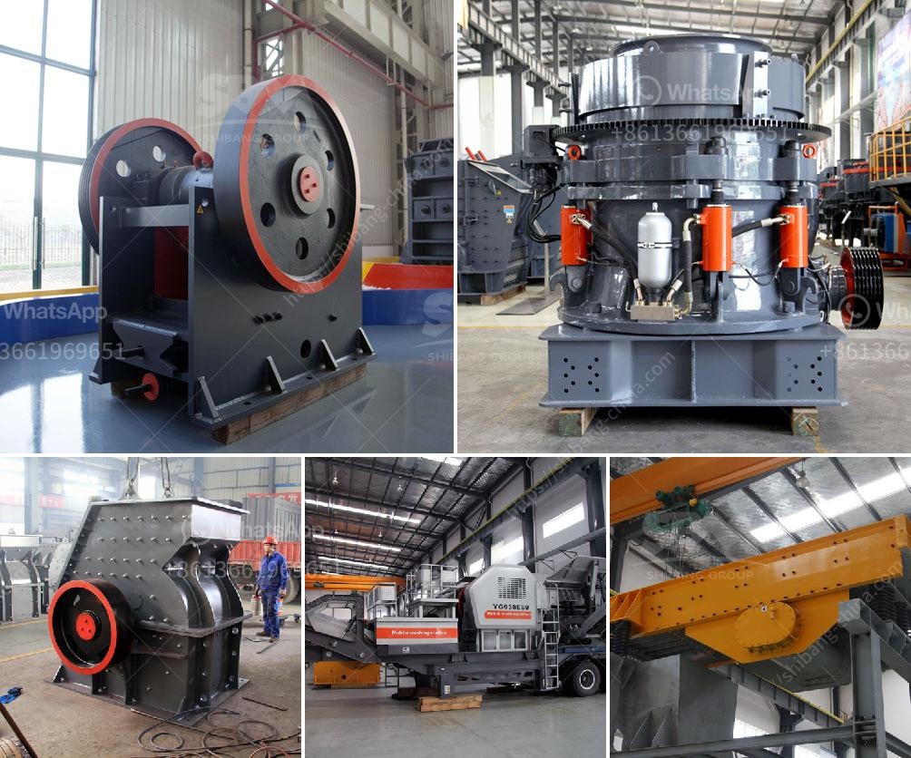

<h3>bauxite processing into aluminum</h3>
Aluminum, the second most abundant metallic element in the Earth's crust, has become an integral part of our modern lives. This versatile metal is used in various industries, ranging from aerospace engineering to packaging and construction. But have you ever wondered how bauxite, the primary ore used to produce aluminum, is processed to obtain this valuable metal? Let's delve into the world of bauxite processing and explore the fascinating journey of transforming bauxite into aluminum.

Bauxite, a clay-like rock composed mainly of aluminum hydroxide minerals, was discovered in the 19th century. Today, it is considered the primary source of aluminum and is found in numerous countries worldwide, from Australia to Guinea. Bauxite ore is typically extracted through open-pit mining methods.

The first step in the bauxite processing journey is the crushing and grinding of the ore. These operations reduce the particle size of bauxite and prepare it for further processing – a process called bauxite beneficiation.

Bauxite beneficiation involves several stages of crushing, scrubbing, and desilication, which removes impurities like silica. After crushing and grinding, the bauxite undergoes a process called digestion in which it is mixed with a hot solution of sodium hydroxide, resulting in the formation of a soluble sodium aluminate compound. This compound is then separated from the insoluble impurities, leaving behind a concentrated solution of sodium aluminate.

The next stage in the bauxite processing journey is precipitation. The concentrated sodium aluminate solution is cooled and seeded with crystals to initiate aluminum trihydrate precipitation. This aluminum trihydrate undergoes further filtration and calcination to remove water and produce alumina or aluminum oxide.

Now comes the pivotal step in the transformation of bauxite into aluminum – the Hall-Héroult process, also known as smelting. In this electrolytic process, a molten cryolite (a sodium aluminum fluoride mineral) is used as the solvent, and carbon electrodes are immersed in the molten electrolyte. The carbon anodes react with oxygen in the alumina to produce carbon dioxide and carbon monoxide. The resultant aluminum ions are then attracted to the carbon cathodes, where they are reduced back to aluminum metal.

The aluminum produced through smelting is not in its pure form; it contains various impurities. To obtain pure aluminum, the metal undergoes a refining process known as electrolysis. In this process, the impure aluminum is dissolved in molten cryolite and subjected to a direct electric current. The impurities settle at the bottom of the cell, leaving behind pure aluminum that can be further processed.

Once the pure aluminum is obtained, it can be alloyed with additional elements to enhance its properties. Different alloys are created for specific applications, adding strength, corrosion resistance, or other desired attributes. These alloys can then be shaped into various forms, such as sheets, rods, or extrusions, using various metallurgical techniques.

In conclusion, the journey from bauxite processing to obtaining aluminum is an intricate and fascinating one. The meticulous steps involved in transforming bauxite ore into a versatile metal give us the opportunity to utilize this abundant resource in countless applications. From aircraft construction to beverage cans, aluminum serves as the backbone of many industries, making our lives safer, more convenient, and more sustainable.
<h3>Contact us</h3><ul><li><strong>Whatsapp:&nbsp;<a href="https://wa.me/8613661969651">+8613661969651</a></strong></li><li><a href="https://swt.shibang-china.com/?git&amp;zhl&amp;bauxite processing into aluminum"><strong>Online Service(chat now)</strong></a></li></ul><h3>Related</h3><ul><li><a href='horizontal shaft impact crusher.md'>horizontal shaft impact crusher</a></li><li><a href='rock crushing plants for sale.md'>rock crushing plants for sale</a></li><li><a href='stone crusher 50tons per hour.md'>stone crusher 50tons per hour</a></li><li><a href='bentonite crushers manufacturers.md'>bentonite crushers manufacturers</a></li><li><a href='coal mill crusher for sale stone crusher machine.md'>coal mill crusher for sale stone crusher machine</a></li></ul>