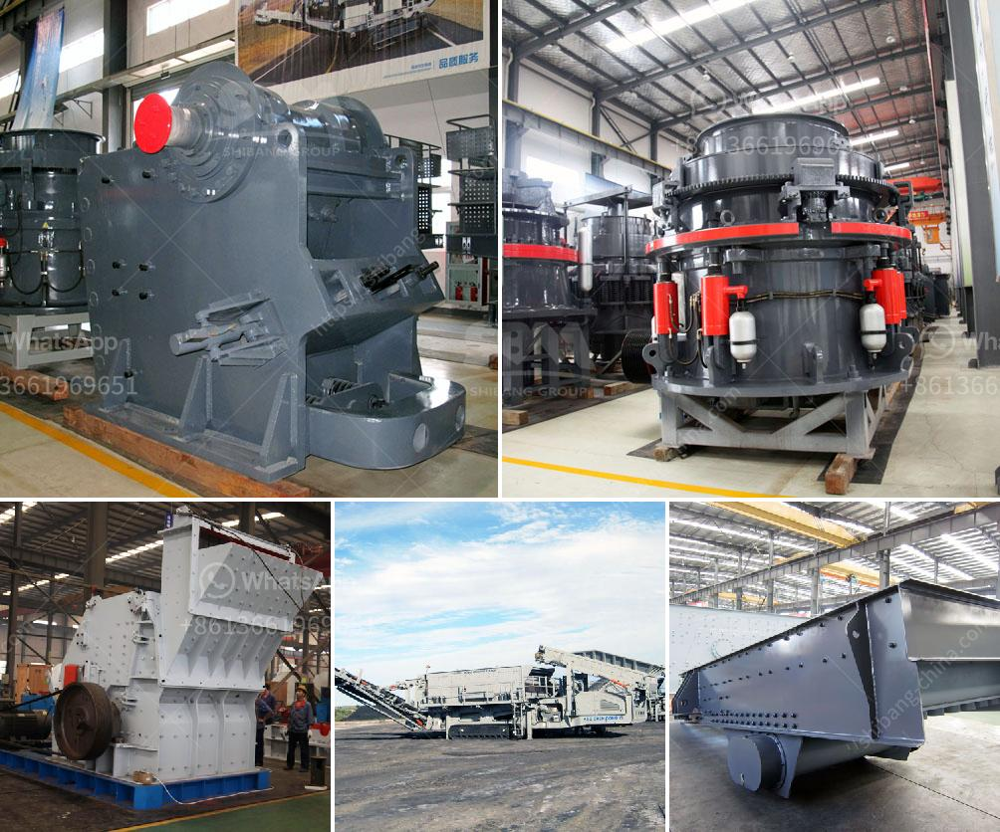

<h3>belt conveyor design free</h3>
Belt conveyors are widely used in industries for the transportation of various materials, such as bulk materials, coal, ore, sand, fertilizer, and grain. They are one of the most efficient and cost-effective methods of moving bulk materials over long distances.

The design of a belt conveyor plays a crucial role in ensuring the smooth and efficient transportation of materials. Several key factors need to be considered in the design process to ensure the conveyor system meets the specific requirements of the application.

The first step in the design process is determining the required capacity of the conveyor. This involves calculating the maximum amount of material that needs to be conveyed per unit of time. Factors such as product density, conveyor speed, and desired production rate are considered to determine the conveyor's capacity.

Once the capacity is determined, the next step is to select the appropriate belt width and speed. The belt width should be wide enough to accommodate the material without excessive spillage or blockage, while the belt speed needs to be adjusted to ensure the materials are transported at an optimal rate.

The selection of the belt material is also important in conveyor design. The material should be chosen based on the type and characteristics of the material being transported. For example, for abrasive materials, a belt with high abrasion resistance would be required. Similarly, for high-temperature materials, a heat-resistant belt is necessary.

The conveyor's drive system is another crucial aspect of the design. The power and type of drive depend on factors such as the length and angle of the conveyor, the weight of the materials, and the required speed. Common drive types include electric motors, hydraulic drives, and pneumatic drives.

To ensure the materials are properly contained and transferred, appropriate loading and discharge systems need to be incorporated into the conveyor design. The loading system should evenly distribute the materials onto the belt to avoid spillage and material buildup, while the discharge system should facilitate efficient transfer of materials from the belt to the desired destination.

Safety features are an integral part of any conveyor design. Emergency stop switches, safety guards, and proper training for operators are essential to minimize the risk of accidents and ensure the safe operation of the conveyor system.

In addition to these design considerations, regular maintenance and inspection of the conveyor system are crucial to maximize its lifespan and prevent unexpected breakdowns. Lubrication of moving parts, regular belt tension checks, and monitoring of motor and drive performance are some of the maintenance tasks that should be undertaken.

Overall, the design of a belt conveyor involves careful consideration of various factors to ensure the efficient and safe transportation of materials. By selecting the appropriate belt width, speed, material, and drive system, and incorporating proper loading and discharge systems, a well-designed conveyor system can greatly enhance productivity and profitability for industries.
<h3>Contact us</h3><ul><li><strong>Whatsapp:&nbsp;<a href="https://wa.me/8613661969651">+8613661969651</a></strong></li><li><a href="https://swt.shibang-china.com/?git&amp;zhl&amp;belt conveyor design free"><strong>Online Service(chat now)</strong></a></li></ul><h3>Related</h3><ul><li><a href='hammer mill prices.md'>hammer mill prices</a></li><li><a href='small scale mobile sand and stone crushers.md'>small scale mobile sand and stone crushers</a></li><li><a href='price of a stone crusher.md'>price of a stone crusher</a></li><li><a href='to buy second hand cement plant in india.md'>to buy second hand cement plant in india</a></li><li><a href='jaw crusher used india.md'>jaw crusher used india</a></li></ul>