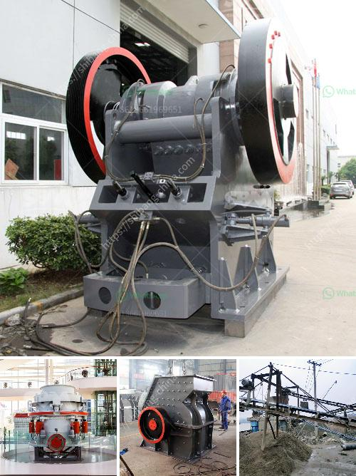

<h3>belt conveyor for sale china</h3>
If you are in the manufacturing or industrial industry, you understand the importance of reliable and efficient transportation of goods within your facility. A belt conveyor is an essential component that helps streamline the movement of products. And if you are looking for a belt conveyor for sale, China should be high on your list of options.

China has established itself as a global manufacturing powerhouse, renowned for its high-quality products at competitive prices. This is no different when it comes to belt conveyors. China offers a wide range of belt conveyors suitable for various industries and applications.

One of the key advantages of purchasing a belt conveyor from China is cost-effectiveness. Chinese manufacturers often offer their products at more affordable prices compared to their American or European counterparts. This is due to lower labor and operational costs, allowing them to produce high-quality products at lower prices.

In addition to cost-effectiveness, Chinese belt conveyor manufacturers also prioritize quality and durability. They make use of advanced technology and adhere to stringent quality control measures to ensure that their products meet international standards. Whether you are transporting lightweight or heavy materials, you can find a belt conveyor in China that is built to withstand the demands of your application.

Furthermore, China has a vast network of conveyor manufacturers and suppliers, offering a wide selection of belt conveyor options. You can find conveyors with different belt widths, lengths, and load capacities to suit your specific requirements. Whether you need a straight conveyor, curved conveyor, or inclined conveyor, Chinese manufacturers can provide you with a solution tailored to your needs.

When searching for a belt conveyor for sale, China should not be overlooked. With affordable prices, high-quality products, and a wide range of options, Chinese belt conveyors can help enhance the efficiency and productivity of your manufacturing facility. So, consider exploring the belt conveyors available in China and find the perfect solution for your business.
<h3>Contact us</h3><ul><li><strong>Whatsapp:&nbsp;<a href="https://wa.me/8613661969651">+8613661969651</a></strong></li><li><a href="https://swt.shibang-china.com/?git&amp;zhl&amp;belt conveyor for sale china"><strong>Online Service(chat now)</strong></a></li></ul><h3>Related</h3><ul><li><a href='proposal pabrik stone crusher.md'>proposal pabrik stone crusher</a></li><li><a href='ball mill screen 200 tph.md'>ball mill screen 200 tph</a></li><li><a href='coal crushing and screening plant.md'>coal crushing and screening plant</a></li><li><a href='gravel cone crusher for sale.md'>gravel cone crusher for sale</a></li><li><a href='stone crusher fairs.md'>stone crusher fairs</a></li></ul>