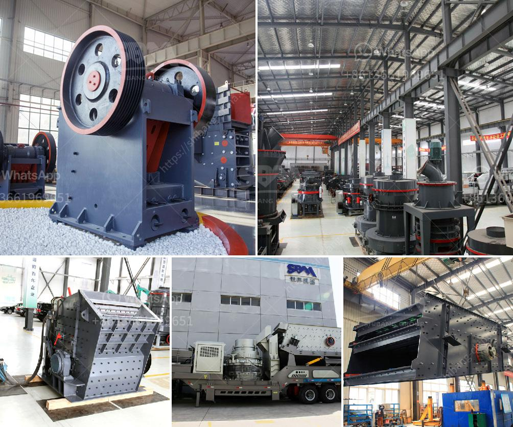

<h3>belt conveyors used in crushing plant</h3>
Belt conveyors are commonly used in crushing plants to transport materials from one area to another. They are designed to be durable, efficient, and reliable, making them an essential piece of equipment in the crushing process. 

One of the main advantages of belt conveyors is their ability to handle a wide range of materials, including gravel, limestone, crushed rock, and more. They can transport these materials over long distances, making them suitable for large crushing plants.

In a crushing plant, the materials are typically loaded onto the conveyor belt by a front-end loader or excavator. The conveyor belt then moves the materials into the crusher, allowing it to break up and process the materials into smaller pieces. After the crushing process, the conveyor belt carries the processed materials to a stockpile or another area of the plant for further processing or distribution.

The design of belt conveyors used in crushing plants is crucial to their overall functionality and efficiency. The conveyor belt must be properly sized to accommodate the maximum capacity of the crusher and ensure efficient operation. Additionally, the belt must also be strong enough to carry heavy loads without stretching or breaking.

Maintenance is also essential for the proper functioning of belt conveyors in crushing plants. Regular inspections and cleaning are necessary to prevent buildup of materials and ensure the conveyor belt is free from any obstructions that may hinder its performance. Lubrication of the moving parts is also important to prevent wear and tear and prolong the life of the conveyor.

Overall, belt conveyors play a crucial role in the crushing process of plants by efficiently transporting materials from one area to another. They are durable, efficient, and reliable, making them an essential piece of equipment in any crushing plant. With proper maintenance and care, belt conveyors can ensure smooth and continuous operation, helping to maximize productivity and achieve optimal results.
<h3>Contact us</h3><ul><li><strong>Whatsapp:&nbsp;<a href="https://wa.me/8613661969651">+8613661969651</a></strong></li><li><a href="https://swt.shibang-china.com/?git&amp;zhl&amp;belt conveyors used in crushing plant"><strong>Online Service(chat now)</strong></a></li></ul><h3>Related</h3><ul><li><a href='clinker grinding unit of 1000 tpd.md'>clinker grinding unit of 1000 tpd</a></li><li><a href='by products of copper processing.md'>by products of copper processing</a></li><li><a href='ball mill specification limestone grinding.md'>ball mill specification limestone grinding</a></li><li><a href='sample quotation letter for sand and stone.md'>sample quotation letter for sand and stone</a></li><li><a href='sand making machine zenith.md'>sand making machine zenith</a></li></ul>