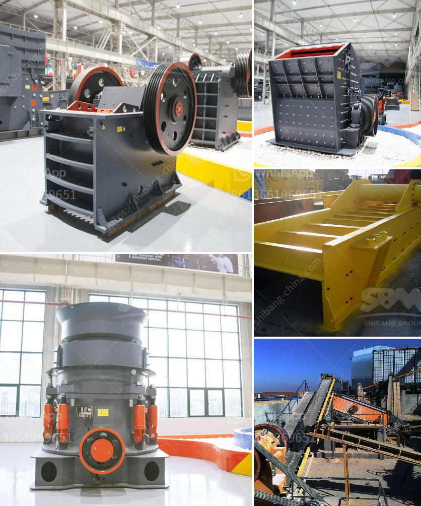

<h3>benefit analysis for granite mining</h3>
Granite mining, or extracting granite from the earth, has been a booming industry worldwide for several decades now. Granite has a range of colors and patterns, making it a popular choice for countertops, floors, and other architectural purposes. However, as with any mining activity, granite mining comes with its own set of benefits and challenges that need careful consideration.

One significant benefit of granite mining is the creation of employment opportunities for local communities. Mining operations require a skilled workforce to operate heavy machinery, manage logistics, and carry out various mining activities. This helps generate income for individuals and boosts the overall economy of the region.

Additionally, granite mining contributes to infrastructure development. The extracted granite is used extensively in construction projects, ranging from buildings and bridges to roadways and dams. The durability and strength of granite make it an ideal material for such projects, ensuring long-lasting structures.

Furthermore, granite mining can have a positive impact on the environment. Quarries created for extraction are often reclaimed afterward, transforming into beautiful lakes or recreational areas. The mining process involves cutting the granite into slabs of different sizes, reducing waste to a minimum. The leftover granite pieces can be reused for other projects, minimizing material wastage.

However, it is necessary to carefully consider the potential drawbacks of granite mining as well. One major challenge is the disruption of local ecosystems and habitats. Mining operations can lead to the destruction of vegetation and wildlife habitats. It is crucial for mining companies to implement sustainable practices and mitigate their impact on the environment through measures like reforestation and wildlife conservation efforts.

Another concern is the impact of dust and noise pollution on nearby communities. Granite mining involves heavy machinery operations, which can generate high levels of dust and noise. To address this issue, mining companies must regularly monitor air and noise pollution levels and take steps to minimize their impact through the use of water suppression techniques and noise reduction measures.

In conclusion, granite mining offers several benefits including job creation, infrastructure development, and environmental reclamation. However, it is crucial to strike a balance between the economic advantages and potential social and environmental challenges. Implementing sustainable practices and engaging with local communities are vital for ensuring responsible mining that maximizes benefits while minimizing negative impacts.
<h3>Contact us</h3><ul><li><strong>Whatsapp:&nbsp;<a href="https://wa.me/8613661969651">+8613661969651</a></strong></li><li><a href="https://swt.shibang-china.com/?git&amp;zhl&amp;benefit analysis for granite mining"><strong>Online Service(chat now)</strong></a></li></ul><h3>Related</h3><ul><li><a href='clay crusher machine in india.md'>clay crusher machine in india</a></li><li><a href='vertical impact crusher manufacturer in india.md'>vertical impact crusher manufacturer in india</a></li><li><a href='price of smallest chippings crusher plant.md'>price of smallest chippings crusher plant</a></li><li><a href='granite business plan ppt.md'>granite business plan ppt</a></li><li><a href='jaw impact crusher poland.md'>jaw impact crusher poland</a></li></ul>