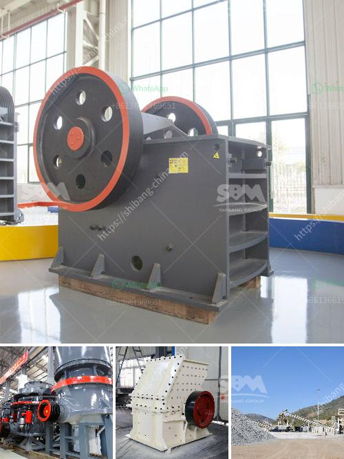

<h3>bentonite crushers manufacturers</h3>
Bentonite is a renowned name in the field of mineral industry. The mineral is mined from the earth’s surface and processed according to the customer’s specifications. In the automotive, plastics, coatings, and construction industries, bentonite is used as a binding agent and plays a crucial role in retaining the integrity of the final product. Bentonite manufacturers understand the importance of delivering high-quality bentonite to their customers. Their crushers and grinders are of superior quality and provide a hassle-free operation.

Bentonite crushers manufacturers in rajasthan have been more rampant in recent years. The reasons that bentonite crushers manufacturers are more active in the market are that the industry has more investment sources, more favorable policies, and good economic benefits. In short, the environmental protection policies and their advantages have greatly promoted the development of the industry, which naturally drives the demand for bentonite crushers manufacturers. In recent years, bentonite crushers manufacturers have achieved outstanding performance in the domestic industry.

However, with the increasing number of bentonite crushers manufacturers, the competition is also more intense. In order to obtain favorable development opportunities, many manufacturers have turned their attention to technological innovation and product research and development. By constantly improving their technological level, they enhance their competitiveness in the market.

One such innovative solution is the use of mechanical crushers or grinders. The use of crushers not only increases efficiency and productivity but also minimizes the risk of manual handling of large chunks of bentonite. This reduces the chances of accidents or injuries and ensures the safety of the workers.

Another innovation is the use of mobile crushers. These crushers can be easily transported to the mining site and require minimum installation and maintenance. They offer flexibility in terms of crushing various types of bentonite, eliminating the need for multiple machines and reducing operational costs. This mobile solution has revolutionized the mining industry and made it more efficient.

Furthermore, bentonite crushers manufacturers are manufacturing hydraulic cone crushers, which are designed to deliver exceptional performance with high speed and reliability. Being used as a primary crusher, the hydraulic cone crusher offers advanced structural design, excellent crushing capacity, and reliability, along with a wide range of application capabilities.

Overall, bentonite crushers manufacturers have established themselves in the market through constant innovation and improved designs. With an array of crushing solutions, they cater to various applications in the bentonite industry. As the market demand for bentonite continues to increase, it is expected that the manufacturers will continue to improve their offerings and provide even more efficient and reliable crushers. The future of the bentonite industry looks promising, with manufacturers focusing on technological advancements and delivering high-quality solutions to meet customer requirements.

In conclusion, bentonite crushers manufacturers are offering innovative solutions to their customers by investing in advanced technology and research. With a focus on improving efficiency, ensuring safety, and delivering superior performance, these manufacturers are playing a key role in driving the growth of the bentonite industry. As the demand for bentonite continues to rise, manufacturers need to keep pace with market trends and provide reliable and efficient crushing solutions.
<h3>Contact us</h3><ul><li><strong>Whatsapp:&nbsp;<a href="https://wa.me/8613661969651">+8613661969651</a></strong></li><li><a href="https://swt.shibang-china.com/?git&amp;zhl&amp;bentonite crushers manufacturers"><strong>Online Service(chat now)</strong></a></li></ul><h3>Related</h3><ul><li><a href='price of aggregate crusher machine in ethiopia.md'>price of aggregate crusher machine in ethiopia</a></li><li><a href='how to improve grinding efficiency of a mill.md'>how to improve grinding efficiency of a mill</a></li><li><a href='limestone processing plant philippines.md'>limestone processing plant philippines</a></li><li><a href='flow chart for gold extraction from ores.md'>flow chart for gold extraction from ores</a></li><li><a href='complete aggregate crushing plant in usa.md'>complete aggregate crushing plant in usa</a></li></ul>