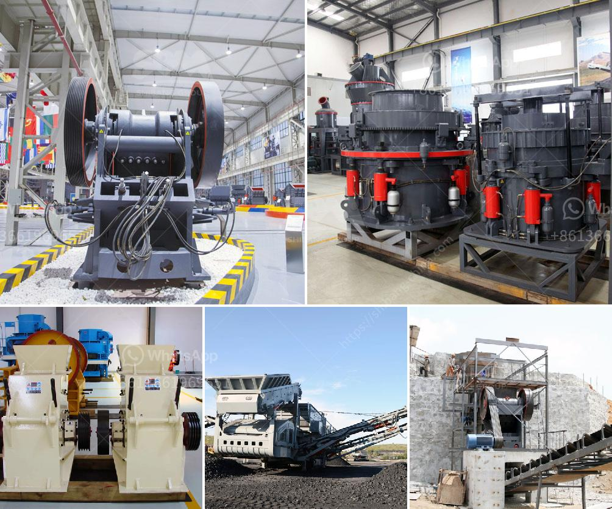

<h3>bentonite grinding project</h3>
Bentonite is a versatile and natural mineral with multiple uses across various industries. One of its most vital applications is as a grinding material for increasing the efficiency of various processes. A bentonite grinding project aims to process and transform this mineral into various beneficial products such as oil-drilling fluids, cat litter, and many others.

The process of bentonite grinding involves numerous steps and stages, from mine to market. In summary, it consists of mining, drying, grinding, packaging, and quality control. The bentonite deposit is first extracted through various mining methods, depending on the nature and location of the mineral. Once extracted, the bentonite is carefully dried to reduce its moisture content, which improves its grinding efficiency.

Grinding of bentonite is mainly performed using two types of mills: hammer mills and roller mills. In the hammer mill, the bentonite is pulverized to particles of a few millimeters in size, which enhances its surface area and facilitates the dispersion of the mineral within a liquid medium. Roller mills, on the other hand, crush the bentonite into finer particles, resulting in a more homogeneous and uniform product.

The ground bentonite is then packaged in various forms suitable for its intended application. For instance, for oil-drilling fluid applications, it is usually packaged in 25kg bags, while for cat litter production, it may be packaged in larger bags or even bulk shipments.

Quality control is an essential aspect of any bentonite grinding project. It ensures that the final product meets the required specifications and is free from any contaminants or impurities that may compromise its performance. Through rigorous testing and analysis, the grinding project ensures that the bentonite meets the desired standards for specific applications.

In conclusion, a bentonite grinding project plays a crucial role in enhancing the usability and efficiency of this natural mineral. By transforming it into various beneficial products, such as oil-drilling fluids and cat litter, the grinding project unlocks the full potential of bentonite and contributes to the growth of multiple industries.
<h3>Contact us</h3><ul><li><strong>Whatsapp:&nbsp;<a href="https://wa.me/8613661969651">+8613661969651</a></strong></li><li><a href="https://swt.shibang-china.com/?git&amp;zhl&amp;bentonite grinding project"><strong>Online Service(chat now)</strong></a></li></ul><h3>Related</h3><ul><li><a href='marble crushing machinery.md'>marble crushing machinery</a></li><li><a href='grinding ball mill machine.md'>grinding ball mill machine</a></li><li><a href='grinder mill china.md'>grinder mill china</a></li><li><a href='ball mill for sand and gravel.md'>ball mill for sand and gravel</a></li><li><a href='prices of aggregate crusher plants.md'>prices of aggregate crusher plants</a></li></ul>