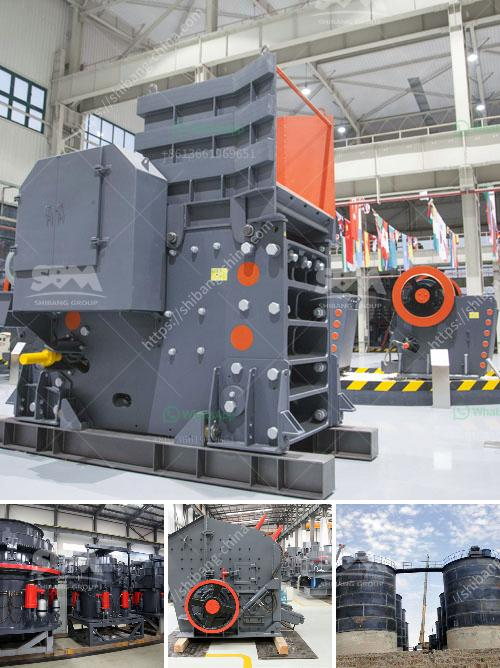

<h3>bentonite mill project report</h3>
Bentonite is a versatile clay composed of the mineral montmorillonite which is commonly used in various industrial applications. It is mainly used as a binding agent, absorbent, and clarifier in many industries such as oil and gas, pharmaceuticals, construction, and agriculture.

To meet the growing demand for bentonite, a bentonite mill project report is a necessary consideration for investors. As it involves various stages, the project can be financially rewarding, as well as provide employment opportunities for many people.

The bentonite mill project report discusses the project's investment and operational costs, as well as the processing requirements. The report also outlines the estimated output and returns on investment, which can help investors make informed decisions and plan for the future.

The report includes a detailed analysis of the market trends and key players in the industry. It highlights the demand for bentonite and its potential growth in the coming years. This information can be useful for investors to assess the market conditions and make strategic decisions.

Furthermore, the project report provides information on the technology and machinery required for the bentonite milling process. It discusses the raw material requirements and the necessary infrastructure. This knowledge helps investors plan the project effectively and ensure its smooth operation.

In conclusion, the bentonite mill project report is a comprehensive document that outlines the potential for a project's success and profitability. It helps investors analyze the market trends and make informed decisions. Bentoni te has a wide range of industrial applications, making it a lucrative investment opportunity. With proper planning and execution, a bentonite mill project can yield significant returns for investors.
<h3>Contact us</h3><ul><li><strong>Whatsapp:&nbsp;<a href="https://wa.me/8613661969651">+8613661969651</a></strong></li><li><a href="https://swt.shibang-china.com/?git&amp;zhl&amp;bentonite mill project report"><strong>Online Service(chat now)</strong></a></li></ul><h3>Related</h3><ul><li><a href='jaw crusher project report pdf.md'>jaw crusher project report pdf</a></li><li><a href='bentonite processing plant alibaba.md'>bentonite processing plant alibaba</a></li><li><a href='quarry stone plant.md'>quarry stone plant</a></li><li><a href='mobile crusher tunisia.md'>mobile crusher tunisia</a></li><li><a href='pakistan silica sand washing plant.md'>pakistan silica sand washing plant</a></li></ul>