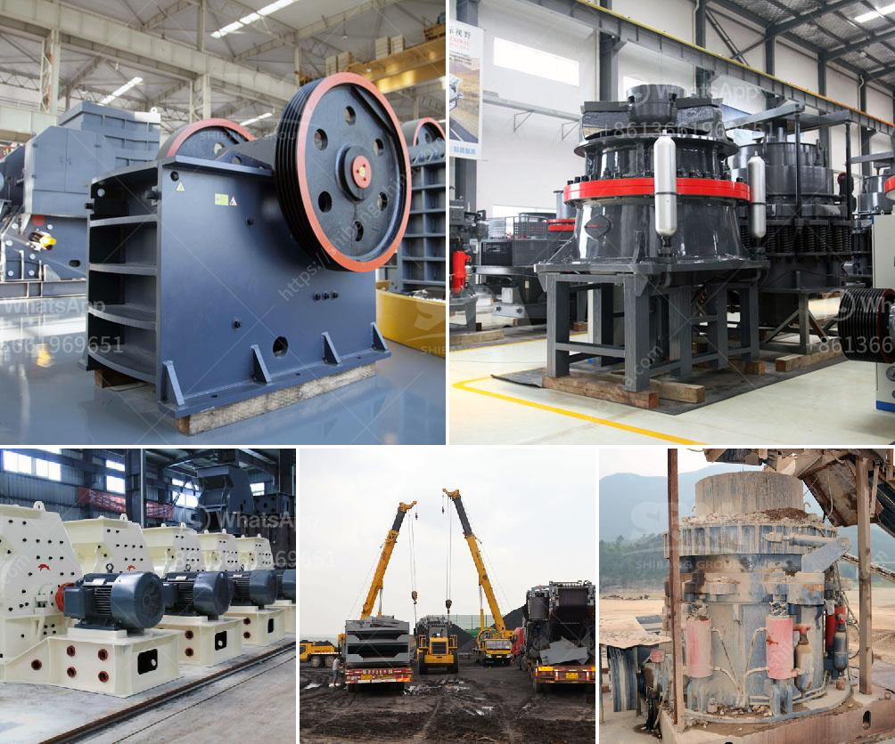

<h3>bentonite powder machine</h3>
Bentonite powder is a natural clay known for its ability to absorb and remove toxins and impurities from the skin and body. It has been used for centuries in various traditional practices for its therapeutic properties. In recent times, the demand for bentonite powder has been on the rise due to its numerous health benefits and its versatile applications, leading to the development of bentonite powder machines.

Bentonite powder machines are specifically designed to process, grind, and enhance the purity and quality of bentonite powder, helping to boost its effectiveness and make it suitable for various applications. These machines are widely used in industries such as cosmetics, pharmaceuticals, agriculture, and environmental remediation, among others.

One of the key features of bentonite powder machines is their ability to finely grind bentonite into a smooth and consistent powder. This is achieved through a combination of crushers, mills, and grinders that pulverize the raw bentonite ore into smaller particles. The finely ground powder is then processed further to remove any impurities or contaminants, ensuring a high-quality final product.

Bentonite powder machines also play a vital role in enhancing the performance of bentonite clay. The machines mix the powdered clay with water or other substances to create a thick, mud-like consistency, which can then be easily applied to the skin or used in various applications. This enhances the clay's absorbent properties, allowing it to effectively draw out toxins, impurities, and excess oil from the skin, leaving it clean, refreshed, and rejuvenated.

The versatility of bentonite powder machines makes them indispensable in various industries. In the cosmetics industry, for example, bentonite powder is used in face masks, body wraps, and other skincare products due to its deep-cleansing and purifying properties. In agriculture, bentonite powder machines are used to create soil amendments that improve the structure and fertility of the soil, leading to better crop yields. In environmental remediation, bentonite powder machines are utilized for the encapsulation and containment of toxic materials, preventing their leakage into the environment.

Investing in a high-quality bentonite powder machine is crucial to ensure the consistent production of pure and effective bentonite powder. It is essential to choose a machine that is durable, efficient, and easy to maintain. Additionally, selecting a machine from a reliable manufacturer or supplier that complies with industry standards and regulations is essential to guarantee its performance and safety.

In conclusion, bentonite powder machines have revolutionized the processing and application of bentonite powder, making it more accessible and beneficial than ever before. These machines provide the means to finely grind, purify, and enhance the clay, allowing it to be used in a wide range of industries and applications. Whether it's for skincare, agriculture, or environmental remediation, bentonite powder machines are essential for harnessing the full potential of this remarkable natural clay.
<h3>Contact us</h3><ul><li><strong>Whatsapp:&nbsp;<a href="https://wa.me/8613661969651">+8613661969651</a></strong></li><li><a href="https://swt.shibang-china.com/?git&amp;zhl&amp;bentonite powder machine"><strong>Online Service(chat now)</strong></a></li></ul><h3>Related</h3><ul><li><a href='germany rocks crushers.md'>germany rocks crushers</a></li><li><a href='companies manufacturing quarry plant in uk.md'>companies manufacturing quarry plant in uk</a></li><li><a href='ball mill unloading system in india.md'>ball mill unloading system in india</a></li><li><a href='proposal for cement plant crusher.md'>proposal for cement plant crusher</a></li><li><a href='estimated cost for cement grinding mill.md'>estimated cost for cement grinding mill</a></li></ul>