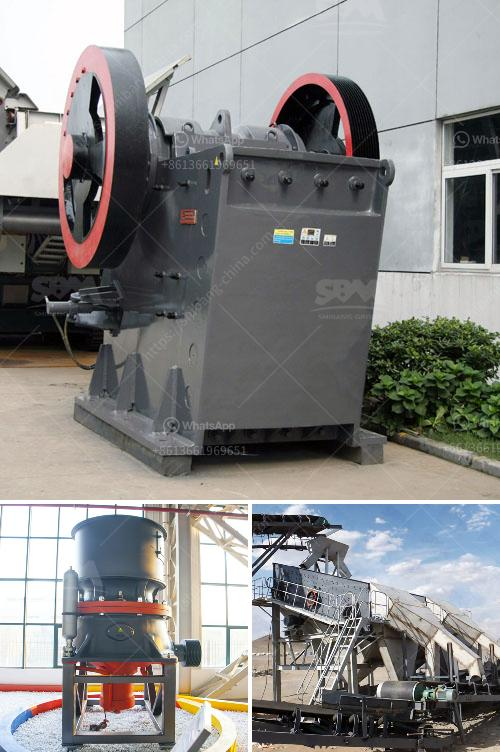

<h3>bentonite powder raymond mill</h3>
Bentonite is a kind of non-metallic mineral with high market value. Its main component is montmorillonite, which is a clay rock consisting of crystalline water, chemical composition of mainly SiO2, Al2O3, MgO and other elements. Bentonite powder is widely used in various industries due to its excellent physical and chemical properties.

Raymond mill is a kind of mill equipment designed and developed by Guilin Hongcheng, which can be used for grinding bentonite powder and other materials. It is a technological process that is ideal for the preparation of 80-600 mesh bentonite powder. This new type of Raymond mill equipment has the advantages of environmental protection and energy saving.

The fineness of the mill can be adjusted arbitrarily between 80-600 mesh. The mill equipment covers a small area, low noise, low dust pollution, and convenient maintenance. Its grinding efficiency is high, and the energy consumption is economical and practical. It is a grinding equipment favored by many bentonite powder customers.

In the field of bentonite grinding, the use of bentonite Raymond mills is currently the most widely used milling equipment. With the development of domestic and foreign industrial technology, the performance of bentonite Raymond mills has been continuously improved, and the overall quality has also been greatly improved. It can better meet the production needs of customers.

The complete set of bentonite Raymond mill production line includes crushing equipment, grinding equipment, grading equipment and dust removal equipment. Each production link has its own characteristics. In order to run the bentonite Raymond mill smoothly and flexibly, the following requirements must be met:

1. The material should be evenly fed into the grinding cavity of the bentonite Raymond mill, avoiding excessive feeding and blocking the air duct, and increasing the output.

2. The material should have a certain moisture content. If the material is too dry, it will cause difficulty in grinding and reduce the output. If the material is too wet, it will cause a blockage in the grinding cavity and affect the normal operation of the equipment.

3. Regularly check the wear condition of the grinding roller and grinding ring. If serious wear is found, it should be replaced in time to avoid affecting the normal operation of the equipment.

4. Regularly clean up the accumulated dust and impurities in the air duct and lubrication points of the bentonite Raymond mill to prevent blockage and ensure the smooth operation of the equipment.

In summary, the bentonite Raymond mill is a kind of grinding equipment designed and developed by Guilin Hongcheng. It has the advantages of small area, low noise, energy saving, environmental protection, high efficiency, and reasonable price. It is a popular mill equipment in the bentonite powder market. With the continuous development of grinding technology, the performance of bentonite Raymond mills will be further improved, which will promote the development of the bentonite powder industry.
<h3>Contact us</h3><ul><li><strong>Whatsapp:&nbsp;<a href="https://wa.me/8613661969651">+8613661969651</a></strong></li><li><a href="https://swt.shibang-china.com/?git&amp;zhl&amp;bentonite powder raymond mill"><strong>Online Service(chat now)</strong></a></li></ul><h3>Related</h3><ul><li><a href='benefit analysis for granite mining.md'>benefit analysis for granite mining</a></li><li><a href='mobile crusher tunisia.md'>mobile crusher tunisia</a></li><li><a href='puzzolana 50 tph crusher plant prices.md'>puzzolana 50 tph crusher plant prices</a></li><li><a href='how to improve grinding efficiency of a mill.md'>how to improve grinding efficiency of a mill</a></li><li><a href='for sale used mobile jaw crusher australia.md'>for sale used mobile jaw crusher australia</a></li></ul>