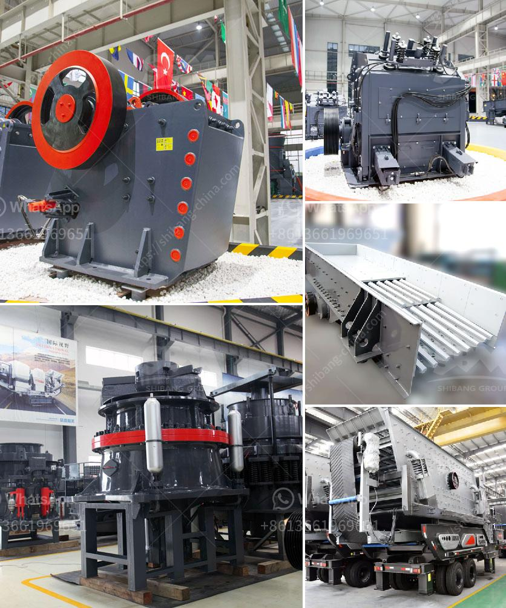

<h3>bentonite processing plant alibaba</h3>
Bentonite is a versatile clay material with many uses and applications. It is derived from volcanic ash deposits that have undergone significant weathering and transformation over time. Bentonite is known for its ability to absorb and retain water and its high capacity for swelling.

To meet the growing demand for bentonite, many companies have established production plants. One such company is Alibaba, a renowned global platform for trade and commerce. Alibaba operates a state-of-the-art bentonite processing plant that utilizes advanced technology to produce high-quality bentonite products.

The processing plant at Alibaba is equipped with modern machinery and equipment, ensuring efficient and cost-effective production. The plant follows strict quality control measures to maintain the standards set by the industry. This ensures that customers receive superior-quality bentonite products that meet their specific requirements.

The primary process involved in the production of bentonite at Alibaba's plant is milling. The raw bentonite is initially crushed into smaller particles to facilitate further processing. The milled bentonite is then classified and separated based on its particle size. This ensures that the final product has consistent and uniform characteristics.

After milling, the bentonite undergoes a series of chemical treatments to enhance its performance and usability. These treatments can include activation, bleaching, and purification processes. Each treatment is carefully monitored to achieve the desired results without compromising the integrity of the clay material.

Once the chemical treatments are complete, the bentonite is dried to remove any remaining moisture. The drying process is carried out using specialized equipment that ensures uniform drying and prevents clumping. The dried bentonite is then subjected to further processing, such as grinding and sieving, to achieve the desired particle size distribution.

Alibaba's bentonite processing plant produces a wide range of bentonite products that cater to various industries and applications. These include but are not limited to drilling muds for oil and gas exploration, foundry sands for casting, animal feed additives, and environmental remediation products.

The bentonite products produced at Alibaba's processing plant are renowned for their exceptional quality and performance. They are backed by extensive research and development efforts aimed at continuously improving the properties and functionalities of bentonite.

In addition to manufacturing high-quality bentonite products, Alibaba also ensures timely delivery and excellent customer service. The company's extensive network and logistics capabilities enable it to reach customers worldwide efficiently. Alibaba's commitment to customer satisfaction has made it a trusted and reliable supplier of bentonite products in the global market.

To sum up, Alibaba's bentonite processing plant is a symbol of excellence in the industry. With its advanced technology, stringent quality control measures, and commitment to customer satisfaction, Alibaba continues to meet the demand for high-quality bentonite products.
<h3>Contact us</h3><ul><li><strong>Whatsapp:&nbsp;<a href="https://wa.me/8613661969651">+8613661969651</a></strong></li><li><a href="https://swt.shibang-china.com/?git&amp;zhl&amp;bentonite processing plant alibaba"><strong>Online Service(chat now)</strong></a></li></ul><h3>Related</h3><ul><li><a href='concrete aggregate crushing plant.md'>concrete aggregate crushing plant</a></li><li><a href='mobile crusher for salt.md'>mobile crusher for salt</a></li><li><a href='rock crusher mercadolibre.md'>rock crusher mercadolibre</a></li><li><a href='decibels generated by hebro jaw crusher.md'>decibels generated by hebro jaw crusher</a></li><li><a href='germany calcium carbonate grinding mill suppliers.md'>germany calcium carbonate grinding mill suppliers</a></li></ul>