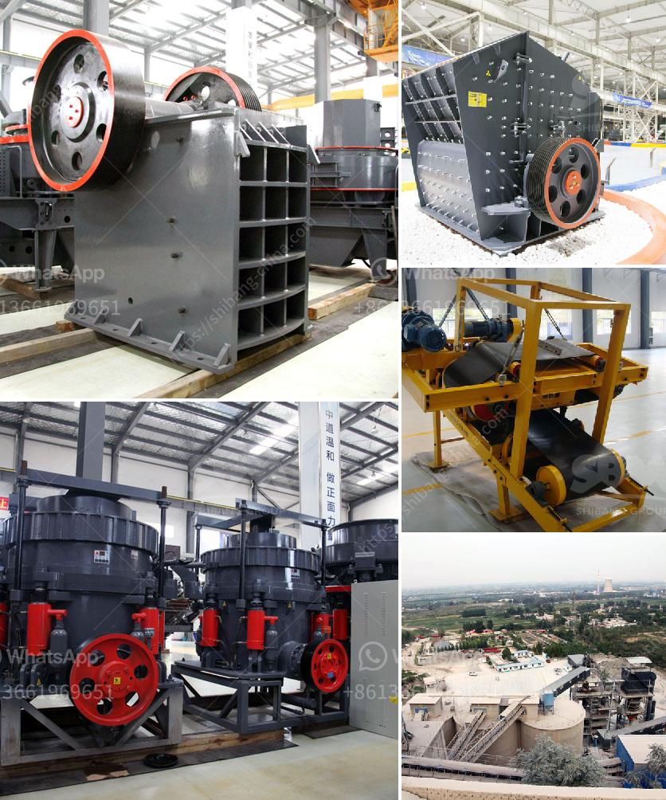

<h3>bentonite production process</h3>
Bentonite has become an essential ingredient in various industries due to its unique properties and versatility. It is commonly used in foundry, construction, drilling, and agriculture applications. The production process of bentonite involves several stages, which help in its purifying and refining to meet the industry standards.

Firstly, the bentonite ore is excavated from mines using conventional mining techniques. The ore is then crushed into smaller pieces and transported to a processing plant. These plants typically use jaw crushers, impact crushers, and cone crushers to reduce the size of the ore particles.

Next, the crushed ore undergoes a process known as beneficiation, which involves removing impurities such as silica, iron oxides, and other minerals. This process is essential to enhance the purity and quality of the bentonite. Various techniques such as magnetic separation, flotation, and gravity separation are used for the beneficiation process.

Once the ore is purified, it is grounded into a fine powder using pulverizing machines. This grinding process helps in achieving the desired particle size and ensures consistent quality across different batches of bentonite.

After grinding, the bentonite powder is subjected to further processing to improve its properties. One such process is called activation, where the purified powder is mixed with water and other additives such as soda ash or calcium chloride. This mixture is then agitated and heated to initiate the activation process. During activation, the clay particles expand and interlayer spaces are created, which increases its adsorption and cation exchange capacity.

The activated bentonite is then subjected to drying to remove any excess moisture. Drying is crucial as it helps in preserving the quality and stability of the bentonite. Various drying techniques, such as rotary dryers or fluidized bed dryers, are used depending on the specific requirements of the application.

Once dried, the bentonite is milled into a fine powder to improve its handling and storage properties. This milling process involves passing the dried powder through a series of mills or grinders to achieve the desired particle size distribution.

The final product is then packaged and stored, ready for transport to different industries. Bentonite is commonly available in bags, bulk containers, or as a slurry, depending on the intended application.

In conclusion, the production process of bentonite is a comprehensive and intricate series of stages that includes mining, crushing, beneficiation, grinding, activation, drying, milling, and packaging. Each process plays a crucial role in refining and purifying the bentonite to meet the industry standards. The demand for bentonite continues to grow, and with advancements in technology, the production process is expected to further evolve to meet the diverse needs of various industries.
<h3>Contact us</h3><ul><li><strong>Whatsapp:&nbsp;<a href="https://wa.me/8613661969651">+8613661969651</a></strong></li><li><a href="https://swt.shibang-china.com/?git&amp;zhl&amp;bentonite production process"><strong>Online Service(chat now)</strong></a></li></ul><h3>Related</h3><ul><li><a href='list of quarry operators in uae.md'>list of quarry operators in uae</a></li><li><a href='use of talc in fertilizer coating process.md'>use of talc in fertilizer coating process</a></li><li><a href='jaw crusher used india.md'>jaw crusher used india</a></li><li><a href='vertical roller mill for cement german.md'>vertical roller mill for cement german</a></li><li><a href='kenya raymond mill.md'>kenya raymond mill</a></li></ul>