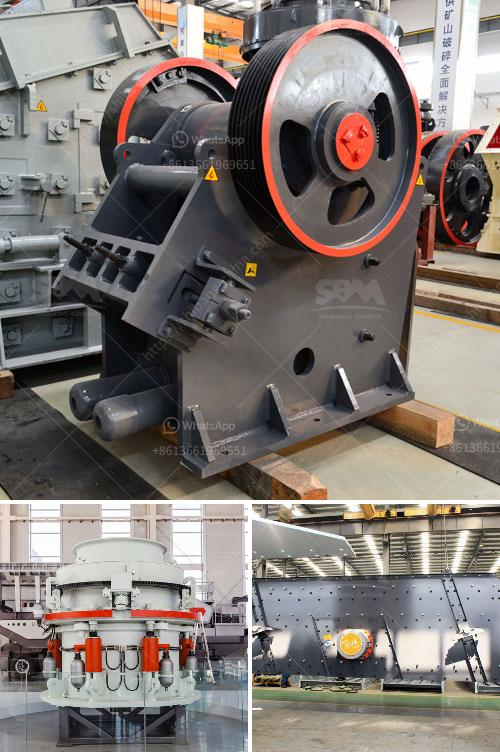

<h3>best prices for portable impact crushers</h3>
When it comes to crushing materials on construction sites or in mining operations, having the right equipment is essential. One such piece of equipment is the portable impact crusher. These versatile machines can handle a wide range of materials and produce high-quality end products. However, finding the best prices for these crushers can be a challenge. In this article, we will explore some of the best options available in the market.

One of the most significant factors to consider when purchasing a portable impact crusher is the price. While it is crucial to balance cost with quality, many buyers are on the lookout for the best deals that offer both affordability and durability.

One option that has gained popularity in recent years is purchasing pre-owned or used portable impact crushers. These crushers are often available at a fraction of the cost of new machines, without compromising on quality. Reputable dealers and manufacturers often have a range of used crushers in excellent condition, making them a viable option for budget-conscious buyers.

It is essential to do thorough research and inspections before finalizing a used portable impact crusher purchase. This includes checking the condition of all key components, such as the engine, mainframe, and rotor, to ensure they are in good working order. Additionally, inquire about any maintenance or repair history to identify potential issues down the line.

Another option to consider is purchasing from manufacturers or dealers who offer discounts or promotions. In the competitive market of portable impact crushers, many suppliers are keen to attract customers by offering special deals. These discounts may be in the form of reduced prices, free accessories, or extended warranty periods. It is worth checking out a range of manufacturers and dealers to compare their prices and the promotions they offer.

Additionally, consider taking advantage of industry conferences, trade shows, or online events where manufacturers and dealers often showcase their products. These events provide an excellent opportunity to connect directly with suppliers and negotiate better prices. It is also a chance to gather information about the latest models and technological advancements in portable impact crushers.

Besides, joining industry-specific associations or organizations can provide access to exclusive discounts or access to supplier networks. Associations often negotiate special pricing agreements for their members, creating an advantageous buying opportunity.

Lastly, consider purchasing portable impact crushers from international suppliers. With the growth of global trade, it is now easier than ever to source equipment from overseas. Different regions may offer different pricing structures, allowing buyers to find competitive deals. However, it is important to research the supplier, ensure they have a solid reputation, and understand all the costs involved in importing the equipment.

In conclusion, finding the best prices for portable impact crushers requires research, comparisons, and consideration of various sources. Exploring options such as used crushers, promotions, industry events, and international suppliers can provide buyers with cost-effective solutions without compromising on quality. By considering these factors, buyers can find the ideal portable impact crusher that meets their requirements and budget.
<h3>Contact us</h3><ul><li><strong>Whatsapp:&nbsp;<a href="https://wa.me/8613661969651">+8613661969651</a></strong></li><li><a href="https://swt.shibang-china.com/?git&amp;zhl&amp;best prices for portable impact crushers"><strong>Online Service(chat now)</strong></a></li></ul><h3>Related</h3><ul><li><a href='quarry crusher equipment costs.md'>quarry crusher equipment costs</a></li><li><a href='crushers for recycling machine uae.md'>crushers for recycling machine uae</a></li><li><a href='rock crusher plant price.md'>rock crusher plant price</a></li><li><a href='list of gold refineries companies in uae.md'>list of gold refineries companies in uae</a></li><li><a href='hammer mill machine.md'>hammer mill machine</a></li></ul>