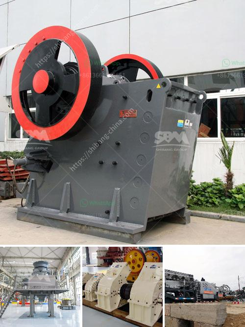

<h3>best stone crusher in kenya</h3>
A stone crusher in Kenya is a machine that reduces rocks into small pieces or dust. A crusher is an important device in the building and construction industry as it ensures that stones are milled to appropriate level and product used for construction. Within Kenya there are many stone crushers that can be used such as limestone crusher whose specifications depend on the different materials used. These stone crushers are used for crushing large rocks into smaller rocks, gravel or dust depending on the requirement.

One of our best stone crusher in Kenya is called Makiga Engineering Services Limited. The company is a licensed distributor of stone crushers in Kenya. Makiga Stone Crushers are designed for primary crushing of even hardest rock. They have different models of stone crushers including Makiga Spring Double Roller Crusher, MLD Manual Stone Crusher and SCM Series Cone Crusher for higher productivity, better reliability and flexibility.

Makiga Stone Crushers are designed by a team of highly-qualified engineers from different sectors such as mechanical engineering, electrical engineering, and eco-friendly technology. The crushers are made of high tensile strength steel and feature robustness, durability, and eco-friendly touch. The company uses advanced technology to manufacture these machines while also considering environmental issues by producing low noise and low dust emission crushers.

Apart from Makiga, there are other notable stone crusher companies to consider when purchasing a crusher in Kenya. The companies include L&M Heavy Industry, Tristar Stone Crusher, Anaconda Equipment Ltd., Green Equipment Supplies Ltd., Vanguard Stone Crusher, and Lonesteel Projects Ltd. Each of these companies offers a wide range of stone crushers with different specifications and uses.

When choosing a stone crusher for your project, it is important to consider factors such as the hardness of the stone, crushing capacity, and power consumption. If the stones are very hard, it would be ideal to use a jaw crusher while an impact crusher would be more suitable for medium hardness stones.

In conclusion, a stone crusher in Kenya is a machine that reduces rocks into smaller pieces or dust. The above article highlights the best stone crushers in Kenya and their prices. A crusher is a must-have for any infrastructure project as it helps reduce the cost of construction, increases productivity, ensures safety, and reduces pollution.
<h3>Contact us</h3><ul><li><strong>Whatsapp:&nbsp;<a href="https://wa.me/8613661969651">+8613661969651</a></strong></li><li><a href="https://swt.shibang-china.com/?git&amp;zhl&amp;best stone crusher in kenya"><strong>Online Service(chat now)</strong></a></li></ul><h3>Related</h3><ul><li><a href='river pebble crusher supplier.md'>river pebble crusher supplier</a></li><li><a href='indonesia raymond mill import agent.md'>indonesia raymond mill import agent</a></li><li><a href='construction machinery company.md'>construction machinery company</a></li><li><a href='industrial gypsum rotary kiln.md'>industrial gypsum rotary kiln</a></li><li><a href='vertical impact crusher manufacturer in india.md'>vertical impact crusher manufacturer in india</a></li></ul>