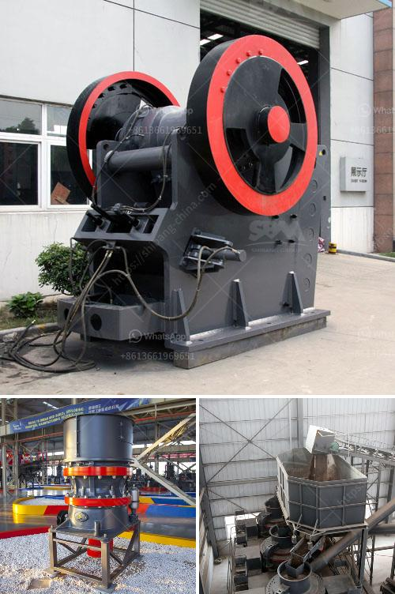

<h3>between cone and horizontal impact crusher</h3>
Cone crushers and horizontal impact crushers are commonly used for secondary crushing operations in various industries. These machines are considered reliable, versatile, and efficient for crushing hard rock and ore. However, there are significant differences between these two types of crushers that should be considered when choosing the right crusher for your application.

One major difference between cone crushers and horizontal impact crushers is the crushing force. In the former, the materials are crushed by the eccentric motion of the mantle which causes compressive and abrasive forces. On the other hand, horizontal impact crushers use impact forces to break the materials. This force is generated by a rotor revolving at high speeds, which imparts kinetic energy to the incoming feed material.

Another key difference is the shape of the crushing chamber. Cone crushers have a conical inner surface, while horizontal impact crushers have a straight chamber design. This allows the cone crusher to produce a more cubical product compared to the horizontal impact crusher, which is known for its consistent and flat-shaped end product.

The operating costs of these crushers also differ. Cone crushers are generally considered more expensive upfront, but their maintenance costs and wear parts replacement are usually lower over time. In contrast, horizontal impact crushers may have higher initial capital costs, but their maintenance and wear costs can be more significant.

Additionally, cone crushers are better suited for crushing abrasive and hard materials, while horizontal impact crushers excel in softer materials like limestone and less abrasive ores. It is important to evaluate the material properties, desired product size, and throughput requirements before deciding on the appropriate crusher for your application.

In conclusion, both cone crushers and horizontal impact crushers have their unique advantages and disadvantages. The choice between these two crushers depends on various factors such as the material properties, desired product size, and operating costs. A careful evaluation of these factors will help you make an informed decision and select the crusher that suits your specific needs.
<h3>Contact us</h3><ul><li><strong>Whatsapp:&nbsp;<a href="https://wa.me/8613661969651">+8613661969651</a></strong></li><li><a href="https://swt.shibang-china.com/?git&amp;zhl&amp;between cone and horizontal impact crusher"><strong>Online Service(chat now)</strong></a></li></ul><h3>Related</h3><ul><li><a href='vibrating screen prices.md'>vibrating screen prices</a></li><li><a href='egypt crusher suppliers manufacturers.md'>egypt crusher suppliers manufacturers</a></li><li><a href='silica sand washing and grinding.md'>silica sand washing and grinding</a></li><li><a href='german zenith made mobile stone crusher.md'>german zenith made mobile stone crusher</a></li><li><a href='dealer of vibrating screen philippines.md'>dealer of vibrating screen philippines</a></li></ul>