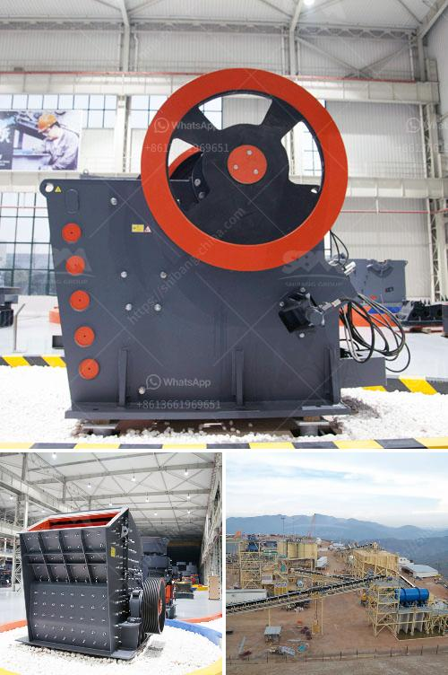

<h3>brick machine canada suppliers</h3>
The construction industry has always been on the lookout for advanced technologies that can streamline the building process. Brick machines have emerged as a game-changer, offering speed, precision, and efficiency in brick production. In Canada, several suppliers provide top-notch brick machines, catering to the growing demand for sustainable and cost-effective construction solutions.

One of the leading suppliers in Canada is ABC Machinery. They specialize in manufacturing and supplying premium quality brick machines that are widely used in various construction projects. ABC Machinery's brick machines are known for their durability, reliability, and high production capacity. Their machines can produce a wide range of bricks, including solid, hollow, interlocking, and paving bricks. With their advanced technology, ABC Machinery ensures that their brick machines are energy-efficient and produce minimal waste, making them an eco-friendly choice for construction companies.

Another notable supplier is Haomei Machinery, which has been providing top-quality brick machines in Canada for decades. Haomei Machinery's brick machines are in high demand due to their unmatched precision and flexibility. Their machines can produce bricks of different sizes and shapes, meeting the diverse requirements of construction projects. Moreover, Haomei Machinery's brick machines are designed to be user-friendly, making the operation and maintenance hassle-free for construction professionals.

The Canadian supplier landscape also includes Bess Makina, a company renowned for its innovative and cost-effective brick machines. Bess Makina's machines are equipped with cutting-edge technology, ensuring high productivity and efficiency. Their machines have the capability to produce bricks with superior quality, allowing for long-lasting and structurally sound constructions. Bess Makina's brick machines are also known for their low power consumption, reducing operational costs for construction businesses.

In conclusion, brick machines have revolutionized the way buildings are constructed, offering numerous advantages compared to traditional brick production methods. Canada is fortunate to have reputable suppliers like ABC Machinery, Haomei Machinery, and Bess Makina, who provide high-quality brick machines. These suppliers are playing a pivotal role in transforming the construction industry by offering sustainable, cost-effective, and efficient solutions. With the continuous advancements in brick machine technology, the future of Canada's construction industry looks brighter than ever.
<h3>Contact us</h3><ul><li><strong>Whatsapp:&nbsp;<a href="https://wa.me/8613661969651">+8613661969651</a></strong></li><li><a href="https://swt.shibang-china.com/?git&amp;zhl&amp;brick machine canada suppliers"><strong>Online Service(chat now)</strong></a></li></ul><h3>Related</h3><ul><li><a href='gypsum bord plant factorie price.md'>gypsum bord plant factorie price</a></li><li><a href='crushing stone made in germany.md'>crushing stone made in germany</a></li><li><a href='company that sells vibratory sieves in spain.md'>company that sells vibratory sieves in spain</a></li><li><a href='project report of lime processing unit.md'>project report of lime processing unit</a></li><li><a href='copper ore processing plant kenya.md'>copper ore processing plant kenya</a></li></ul>