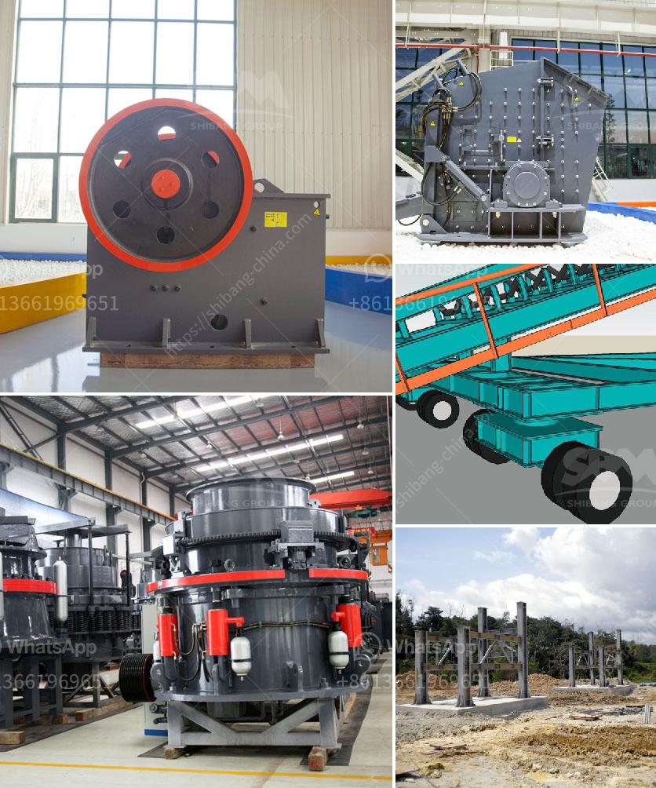

<h3>business plan for a quarry</h3>
A quarry business plan is essential for those seeking to start a quarry project. The business plan serves as a roadmap for success, detailing how the business will operate and outlining its objectives and strategies. It is an important tool for attracting potential investors and securing necessary funding.

The first step in creating a quarry business plan is to determine the objective of the quarry. Will it produce raw materials for construction projects, such as sand, gravel, and crushed stone, or will it mine a specific mineral resource, such as limestone or granite? Identifying the target market and competition is also crucial as it helps assess the potential demand for the quarry's products.

The next step is to develop a comprehensive financial plan. This includes estimating the initial investment required to start the quarry, such as acquiring the necessary land, machinery, and equipment. Additionally, it involves determining operating expenses, staffing costs, and projected revenue. Conducting a thorough market analysis will help determine pricing strategies and sales projections.

Environmental considerations are an important aspect of a quarry business plan. Quarrying can have a significant impact on the environment, including the destruction of natural habitats and the potential for pollution. Addressing these concerns in the business plan is essential for obtaining necessary permits and meeting regulatory requirements. Implementing responsible quarrying practices, such as land rehabilitation and minimizing water usage, can help mitigate these environmental impacts.

Another critical aspect of the quarry business plan is operational management. This includes establishing efficient quarrying processes, ensuring safety protocols are in place, and optimizing transportation logistics. Investing in technology and automation can also improve productivity and reduce costs.

Finally, a marketing and sales strategy should be outlined in the business plan. This includes identifying target customers, developing effective marketing campaigns, and establishing partnerships with construction companies, contractors, and suppliers.

In conclusion, a well-structured business plan is essential for starting a quarry project. It serves as a blueprint for success, providing a clear roadmap for operations, financial projections, environmental considerations, and marketing strategies. By thoroughly evaluating all aspects of the business and planning for contingencies, entrepreneurs can increase their chances of building a profitable and sustainable quarry operation.
<h3>Contact us</h3><ul><li><strong>Whatsapp:&nbsp;<a href="https://wa.me/8613661969651">+8613661969651</a></strong></li><li><a href="https://swt.shibang-china.com/?git&amp;zhl&amp;business plan for a quarry"><strong>Online Service(chat now)</strong></a></li></ul><h3>Related</h3><ul><li><a href='quartz plant and machinary.md'>quartz plant and machinary</a></li><li><a href='small size mobile ore crushers.md'>small size mobile ore crushers</a></li><li><a href='price of stone crushing machine.md'>price of stone crushing machine</a></li><li><a href='difference between hp cone crusher.md'>difference between hp cone crusher</a></li><li><a href='jaw crusher specifications.md'>jaw crusher specifications</a></li></ul>