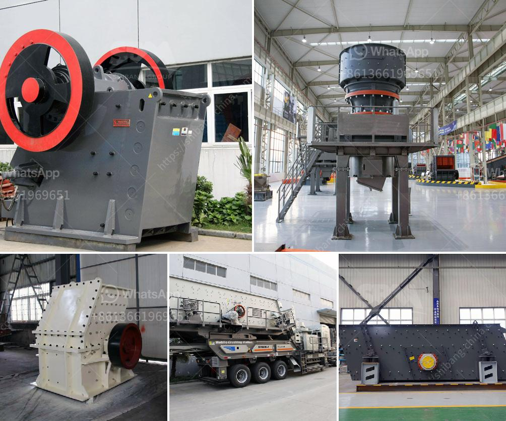

<h3>business plan for stone grinding in ethiopia</h3>
The stone grinding industry in Ethiopia is experiencing booming demand for its services. This sector has experienced rapid growth in recent years, especially in the construction industry. As a result, there is a need for a well-crafted business plan for stone grinding to ensure success in this emerging market.

Firstly, it is important to conduct a thorough market analysis to understand the demand and competition in the industry. This can be done by studying the market trends, identifying potential clients such as construction companies, contractors, and individuals. Additionally, it is crucial to identify other stone grinding businesses in the region to assess their strategies and develop a competitive advantage.

The next step in the business plan is to determine the equipment and machinery required for stone grinding. This may include grinding mills, polishing machines, and other essential tools. It is essential to carefully select high-quality equipment that will ensure efficiency and longevity. While purchasing equipment, it is also important to consider factors such as maintenance costs, availability of spare parts, and after-sales service.

Another crucial aspect of the business plan is to outline the production process. This involves understanding the different types of stones that can be ground and the specific techniques required. It will also be important to determine the size and scale of the operations, including how many workers will be needed and what training they will require.

In addition to production, the business plan must address marketing and sales strategies. This could involve creating a strong online presence through a website and social media platforms. It is also important to establish strong relationships with potential clients, such as construction companies and contractors, through direct marketing efforts and networking.

Finance is a key consideration for any business plan. It is essential to determine the initial investment required for setting up the stone grinding business, including purchasing machinery, renting or buying a workspace, and hiring employees. Additionally, the plan should outline ongoing expenses such as raw material costs, electricity, and marketing expenses. It is also important to project and analyze revenue streams, considering factors such as pricing strategies, market demand, and potential growth opportunities.

Lastly, it is vital to ensure compliance with legal and regulatory requirements. This may include obtaining necessary licenses and permits, as well as meeting health and safety standards to ensure a safe working environment for employees. Complying with environmental laws and regulations is also essential, especially regarding disposal of waste materials generated from the grinding process.

In conclusion, a well-crafted business plan for a stone grinding business in Ethiopia is essential for success in this emerging market. Thorough market analysis, careful selection of equipment, efficient production processes, effective marketing strategies, and a comprehensive financial analysis are all key aspects to consider. By addressing these aspects in the business plan, entrepreneurs can lay a solid foundation for a successful stone grinding business in Ethiopia.
<h3>Contact us</h3><ul><li><strong>Whatsapp:&nbsp;<a href="https://wa.me/8613661969651">+8613661969651</a></strong></li><li><a href="https://swt.shibang-china.com/?git&amp;zhl&amp;business plan for stone grinding in ethiopia"><strong>Online Service(chat now)</strong></a></li></ul><h3>Related</h3><ul><li><a href='stone crusher machine dealer in uae.md'>stone crusher machine dealer in uae</a></li><li><a href='used small rotary kiln price russia.md'>used small rotary kiln price russia</a></li><li><a href='slag grinding machine in india.md'>slag grinding machine in india</a></li><li><a href='pf impact crusher.md'>pf impact crusher</a></li><li><a href='jaw crusher with production capacity of ton hr.md'>jaw crusher with production capacity of ton hr</a></li></ul>