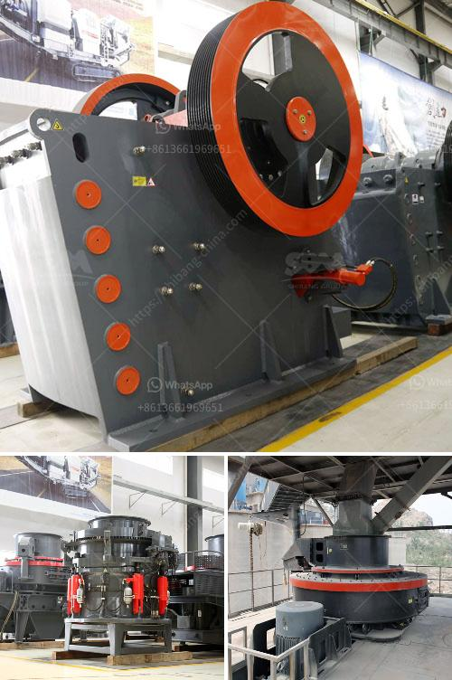

<h3>business plan on manganese ore mining</h3>
Manganese is an essential mineral used in various industrial applications such as steel production, batteries, and fertilizers. With a growing global demand for this versatile metal, investing in manganese ore mining proves to be a lucrative opportunity. However, to ensure success and mitigate potential risks, it is imperative to develop a comprehensive business plan that sets a clear roadmap for stakeholders involved in the venture.

Before initiating any business plan, conducting a detailed market analysis is crucial. In the case of manganese ore mining, it is essential to assess both the global and regional markets. Evaluate the current and projected market trends, including demand, supply, pricing, and competition. Analyzing the industrial sectors dependent on manganese, such as steel manufacturing and battery production, will provide valuable insights for business planning.

The success of a manganese ore mining venture depends significantly on accurate resource prospecting and efficient extraction methods. Collaborate with geologists and mining experts to identify potentially lucrative manganese deposits. Consider the mineralogy, quality, and quantity of the orebody to determine the feasibility of mining. Additionally, analyze the environmental and legal prerequisites associated with mining activities in your target region.

Developing a comprehensive business plan for manganese ore mining requires a thorough understanding of the infrastructure and logistics required to facilitate operations. Assess the availability of transportation, including roads, railways, and ports, to ensure cost-effective ore transportation to market. Study power and water supply capabilities in the region, as they are vital for mining operations. Consider establishing partnerships with local infrastructure or logistics providers to optimize operations.

Formulate a robust operational plan that outlines the various stages of manganese ore mining, starting from site preparation and exploration to extraction, processing, and shipment. Define and quantify the necessary equipment, machinery, and resources required for each stage. Establish a realistic timeline and budgets considering the complexities and challenges associated with mining activities.

Sustainable mining practices are crucial for the long-term viability of any mining operation. In the business plan, incorporate strategies and technologies to minimize the environmental impact, such as implementing water and waste management systems, dust control measures, and land rehabilitation programs. Consider initiatives to promote local employment, community development, and stakeholder engagement, as they play a significant role in gaining social acceptance and regulatory compliance.

Developing accurate financial projections and conducting a detailed risk assessment are essential components of a comprehensive business plan. Determine the capital investment required for acquiring mining rights, equipment, operational expenses, and marketing efforts. Factor in pricing volatility, market fluctuations, and potential environmental liabilities. Identify potential risks and develop mitigation strategies to ensure the long-term sustainability of the venture.

Developing a robust business plan for manganese ore mining is crucial for the success of the venture. A comprehensive analysis of the market, resource prospecting, infrastructure, and logistics, operational plan, environmental and social responsibility, financial projections, and risk assessment are vital elements of this plan. By taking these factors into account, stakeholders can strategically position their manganese mining operation to meet the global demand and ensure profitability while adhering to sustainable practices.
<h3>Contact us</h3><ul><li><strong>Whatsapp:&nbsp;<a href="https://wa.me/8613661969651">+8613661969651</a></strong></li><li><a href="https://swt.shibang-china.com/?git&amp;zhl&amp;business plan on manganese ore mining"><strong>Online Service(chat now)</strong></a></li></ul><h3>Related</h3><ul><li><a href='crushers in saudi arabia.md'>crushers in saudi arabia</a></li><li><a href='limestone crusher for sale.md'>limestone crusher for sale</a></li><li><a href='cement boll mill grinding media charging formula.md'>cement boll mill grinding media charging formula</a></li><li><a href='estimated budget for a conveyor belt.md'>estimated budget for a conveyor belt</a></li><li><a href='grinding mills in china.md'>grinding mills in china</a></li></ul>