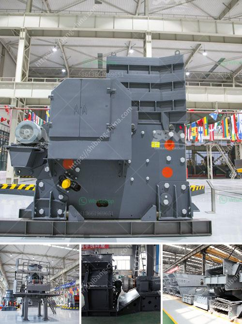

<h3>business plan small scale gold mining</h3>
Gold mining is one of the oldest and most lucrative industries in the world. Present in all continents, it extends its reach into remote areas where other civilizations have not yet had the chance to explore. From Africa to South America, gold is sought after by countless individuals and companies.

For those with limited resources but a strong desire to enter the gold mining industry, a small scale gold mining business plan is key. A well-drafted plan will lay the foundation for growth and profitability, providing a roadmap to success. Here are a few essential elements that should be included:

1. Research and Prospecting: Conduct extensive research on potential mining sites and assess the possibility of finding gold. Determine the quantities available, the cost of extraction, and the expected selling price. This will help you estimate your potential profit and create a realistic business plan.

2. Financing and Equipment: Identify the funding needed to start your mining operation. Seek out investors or arrange for loans to cover the costs of land acquisition, permits, and equipment. Access to heavy machinery, such as excavators and trucks, is essential for efficient gold extraction.

3. Licensing and Permits: Obtain the necessary licenses and permits from local authorities to operate your mining venture legally. Compliance with environmental regulations and social responsibility standards is crucial in this industry. Failure to adhere to regulations can result in hefty fines or the closure of your operation.

4. Safety and Responsible Mining Practices: Prioritize the safety of your workforce and the community in which you operate. Develop plans to prevent accidents, provide training for employees, and implement sustainable mining methods that minimize the environmental impact.

5. Market and Sales Strategy: Analyze the gold market and develop a sales strategy to sell your mined gold. Identify potential buyers such as jewelry manufacturers, bullion traders, or even government agencies. Building relationships with potential customers will help solidify your position in the industry.

6. Financial Projections: Create a detailed financial forecast for the first few years of operation. This should include expected revenue, operational expenses, and profit margins. It will help you measure the success of your business and make adjustments if needed.

Starting a small scale gold mining business requires careful planning and execution. A solid business plan will mitigate risks and set you on the path to achieving your financial goals. With determination, perseverance, and a commitment to responsible mining practices, you can turn your small mining operation into a thriving business in the gold industry.
<h3>Contact us</h3><ul><li><strong>Whatsapp:&nbsp;<a href="https://wa.me/8613661969651">+8613661969651</a></strong></li><li><a href="https://swt.shibang-china.com/?git&amp;zhl&amp;business plan small scale gold mining"><strong>Online Service(chat now)</strong></a></li></ul><h3>Related</h3><ul><li><a href='jaw crusher philippines 50 tons per day.md'>jaw crusher philippines 50 tons per day</a></li><li><a href='production process of cement.md'>production process of cement</a></li><li><a href='hydration process of cement.md'>hydration process of cement</a></li><li><a href='wet grinding ball mills china.md'>wet grinding ball mills china</a></li><li><a href='crushing machine company.md'>crushing machine company</a></li></ul>