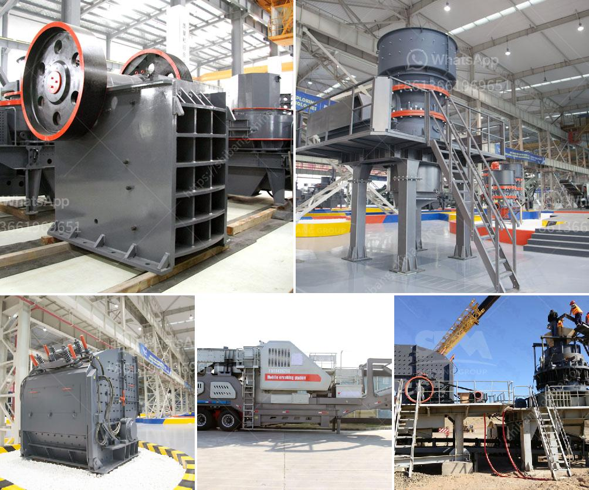

<h3>business plan template for cement plant</h3>
If you're interested in starting a cement plant business, it's essential to have a well-structured business plan in place. A business plan serves as a roadmap and blueprint for your company's growth and success. It outlines your goals, strategies, financial projections, and market analysis. To help you get started, here is a template for a business plan for a cement plant.

Start your business plan with an overview of your cement plant venture. Describe your business concept and mission statement. Highlight the market opportunity and competitive advantage of your plant. Include a summary of your financial projections and growth plan.

Provide detailed information about your cement plant business. Include the legal structure, location, and ownership details. Explain the purpose of your business and its contribution to the cement industry. Discuss your product range, production capacity, and target market.

Conduct a comprehensive analysis of the cement industry in your target market. Explore market trends, demand, and competition. Identify potential customers and key competitors. Analyze their strengths, weaknesses, opportunities, and threats (SWOT analysis). Determine your unique selling proposition and positioning strategy.

Outline your organizational structure and management team. Describe the roles and responsibilities of key personnel, such as plant manager, sales manager, and finance manager. Highlight their qualifications and relevant experience. Explain your hiring strategy and future expansion plans.

Detail your cement products and services. Discuss their features, benefits, and applications. Provide information about your production process, quality control measures, and environmental sustainability practices. Explain any certifications or accreditations obtained.

Define your sales and marketing approach. Identify target market segments, including construction companies, contractors, and infrastructure projects. Develop a pricing strategy based on market research and cost analysis. Describe your distribution channels, advertising campaigns, and promotional activities.

Discuss the daily operations of your cement plant. Describe the location, facilities, and infrastructure required. Highlight the equipment and machinery needed for production. Discuss the sourcing of raw materials, production workflow, and quality assurance measures. Outline your supply chain management and logistics strategy.

Present your financial forecasts and projections. Include income statements, balance sheets, and cash flow statements for the next three to five years. Provide details about start-up costs, capital investments, and funding requirements. Discuss your pricing strategy, revenue streams, and profitability targets. Consider various scenarios and assumptions.

Evaluate potential risks and challenges that may impact your cement plant business. Identify industry-specific risks, such as changes in raw material prices, environmental regulations, or economic downturns. Develop contingency plans and mitigation strategies. Consider insurance coverage and legal obligations.

Summarize your business plan by reiterating the objectives, strategies, and financial projections. Highlight the potential return on investment and growth opportunities. Emphasize your commitment to sustainability and corporate social responsibility. Include contact details for further inquiries.

Creating a business plan for a cement plant is crucial to attract investors, secure financing, and guide your operations. By using this template as a starting point, you can customize and tailor it to your specific requirements. Regularly review and update your business plan to adapt to changing market conditions and objectives. With a well-structured business plan in hand, you'll be better equipped to navigate the challenges and capitalize on the opportunities in the cement industry.
<h3>Contact us</h3><ul><li><strong>Whatsapp:&nbsp;<a href="https://wa.me/8613661969651">+8613661969651</a></strong></li><li><a href="https://swt.shibang-china.com/?git&amp;zhl&amp;business plan template for cement plant"><strong>Online Service(chat now)</strong></a></li></ul><h3>Related</h3><ul><li><a href='stone crusher manufacture.md'>stone crusher manufacture</a></li><li><a href='gravel conveyor belt.md'>gravel conveyor belt</a></li><li><a href='to buy second hand cement plant in india.md'>to buy second hand cement plant in india</a></li><li><a href='gypsum vibrating screen.md'>gypsum vibrating screen</a></li><li><a href='pulverizer coal with gasifier.md'>pulverizer coal with gasifier</a></li></ul>