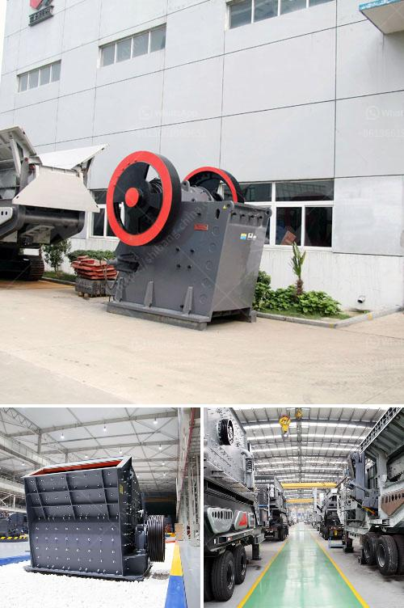

<h3>buy quarry machine from europe</h3>
Are you in the quarrying business and looking to upgrade your machinery? Look no further than Europe for state-of-the-art quarry machines that are built to last and provide unmatched performance. Europe has long been known for its expertise in manufacturing high-quality machinery, and the quarrying sector is no exception.

Investing in machinery is a critical decision for any quarry. It directly impacts the productivity, efficiency, and ultimately the profitability of the business. Therefore, choosing the right equipment is of utmost importance. European quarry machine manufacturers have a proven track record of delivering top-notch machines that meet and exceed industry standards.

One of the key advantages of buying quarry machines from Europe is the wide range of options available. Whether you need crushers, screeners, loaders, or excavators, European manufacturers offer a comprehensive selection of machinery suitable for different quarrying applications. Moreover, these manufacturers have a reputation for constantly innovating and improving their products. This means you can benefit from cutting-edge technology that enhances your operational efficiency and reduces downtime.

Another compelling reason to consider purchasing quarry machines from Europe is the overall quality and durability they offer. European manufacturers are known for their meticulous attention to detail and high-quality standards. The machines are built using superior materials, ensuring that they can withstand the demanding conditions of quarrying operations. This translates into a longer lifespan for your machinery, reducing the frequency of repairs and replacements.

In addition to quality, European quarry machine manufacturers prioritize safety. The machines are designed with operators' well-being in mind, incorporating various safety features and ergonomic designs. Investing in European machinery means providing your workforce with a safe and comfortable environment, reducing the risk of accidents and injuries.

Furthermore, buying quarry machines from Europe provides an opportunity to benefit from expert technical support and after-sales service. European manufacturers have a strong network of authorized dealers and service providers who can assist with installation, training, and maintenance. This ensures that your machinery operates at peak performance, maximizing your productivity and minimizing any potential downtime.

However, it is essential to consider a few factors when buying quarry machines from Europe. Firstly, understand the specific needs and requirements of your quarry to determine the most suitable machinery for your operations. Additionally, consider transportation costs and logistics when importing the equipment. Partnering with a reliable and experienced logistics provider can simplify the process and ensure timely delivery.

In conclusion, purchasing quarry machines from Europe is a wise investment for any quarrying business. The combination of extensive options, exceptional quality, and first-rate support makes European manufacturers an ideal choice. By choosing European machinery, you can enhance your quarry's productivity, efficiency, and profitability, while ensuring the safety and comfort of your workforce. So, why wait? Upgrade your equipment and stay ahead in the quarrying industry with quarry machines from Europe.
<h3>Contact us</h3><ul><li><strong>Whatsapp:&nbsp;<a href="https://wa.me/8613661969651">+8613661969651</a></strong></li><li><a href="https://swt.shibang-china.com/?git&amp;zhl&amp;buy quarry machine from europe"><strong>Online Service(chat now)</strong></a></li></ul><h3>Related</h3><ul><li><a href='stone crushers turkey.md'>stone crushers turkey</a></li><li><a href='used stone crushers for sale india.md'>used stone crushers for sale india</a></li><li><a href='ball mill machine in china.md'>ball mill machine in china</a></li><li><a href='hammer pulverizer machine price.md'>hammer pulverizer machine price</a></li><li><a href='crusher manufacturing companies in india.md'>crusher manufacturing companies in india</a></li></ul>