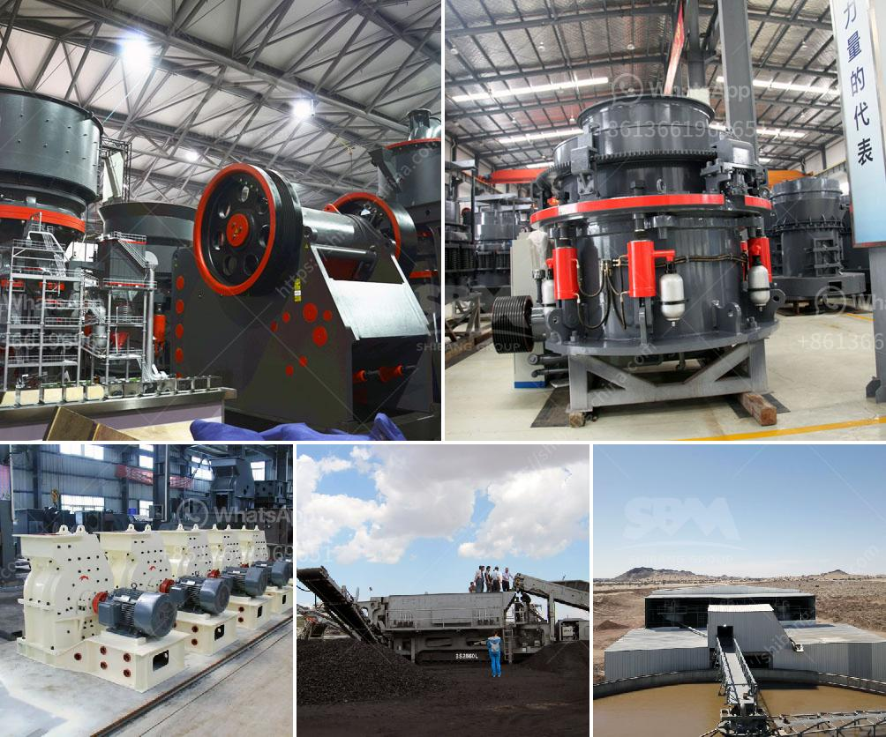

<h3>by products of copper processing</h3>
Copper is a versatile metal that has been used for centuries, and its extraction and processing have evolved over time. As with any industrial process, copper processing generates various by-products that can have both positive and negative effects. In this article, we will explore some of the common by-products of copper processing and their implications.

One significant by-product of copper processing is slag, a glass-like material formed during smelting. Slag contains various impurities and non-metallic elements, and its composition depends on the ore and processing techniques. While slag can be disposed of as waste, it also has potential benefits. For instance, it can be used as a raw material in cement production, reducing the need for quarried limestone and conserving natural resources.

Another by-product of copper processing is sulfur dioxide gas (SO2). During smelting, copper ore is heated to high temperatures, releasing this harmful gas. However, the sulfur dioxide emissions can be mitigated by capturing them and converting them into sulfuric acid, a widely used chemical in various industries. This process is known as sulfur dioxide scrubbing and not only reduces pollution but also generates a valuable product.

Additionally, copper processing produces dust and other particulate matter, which can have adverse effects on air quality and the health of nearby communities. Modern copper processing facilities employ advanced technologies to capture and control these emissions, minimizing their impact on the environment and human well-being.

Moreover, the tailings, a waste product consisting of finely ground rock and traces of copper, are another by-product of copper processing. Proper management of tailings is crucial to prevent contamination of soil and water sources. By utilizing advanced techniques such as flotation and filtering, most of the valuable copper can be extracted from the tailings, reducing waste and maximizing resource efficiency.

In conclusion, copper processing generates several by-products, such as slag, sulfur dioxide, dust, and tailings. While these by-products can be harmful to the environment and human health if not properly managed, they also present opportunities for recycling and resource recovery. Today, the copper industry is actively working towards minimizing its environmental footprint and enhancing the sustainability of its by-product management, ensuring that copper remains a valuable and responsible material for future generations.
<h3>Contact us</h3><ul><li><strong>Whatsapp:&nbsp;<a href="https://wa.me/8613661969651">+8613661969651</a></strong></li><li><a href="https://swt.shibang-china.com/?git&amp;zhl&amp;by products of copper processing"><strong>Online Service(chat now)</strong></a></li></ul><h3>Related</h3><ul><li><a href='small washing plants diamonds.md'>small washing plants diamonds</a></li><li><a href='slag processing plant manufacturers in chile.md'>slag processing plant manufacturers in chile</a></li><li><a href='india stone crusher in bangladesh.md'>india stone crusher in bangladesh</a></li><li><a href='screen clay from limestone rock.md'>screen clay from limestone rock</a></li><li><a href='prices on cone crusher parts.md'>prices on cone crusher parts</a></li></ul>