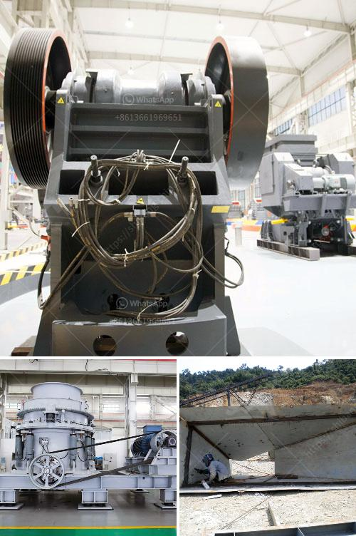

<h3>by products of limestone processing</h3>
Limestone, a sedimentary rock composed mainly of calcium carbonate, is a primary material used in the construction industry. It is widely abundant around the world and is mined for various purposes, including the production of lime, cement, and other building materials. However, the processing of limestone also generates several by-products that have unique applications.

One of the main by-products of limestone processing is limestone powder. This fine powder is often used as a filler material in various industries, such as paints, plastics, and paper. Due to its excellent whiteness and chemical properties, limestone powder enhances the durability and strength of these products. It also provides a smooth surface finish, improving the quality and appearance of finished goods.

Another by-product of limestone processing is limestone sludge or limestone mud. This sludge is the result of the wet processing of limestone during lime production. While it may seem like a waste product, limestone sludge has several beneficial uses. It can be used as an ingredient in the production of fertilizers, as an additive in animal feed, or as a neutralizing agent in wastewater treatment plants.

Moreover, during the production of lime, a by-product called lime kiln dust or LKD is generated. LKD is a fine-grained material that contains trace amounts of lime, silica, alumina, and other minerals. Its high calcium content makes it suitable for various applications, such as soil stabilization, road construction, and the manufacturing of cement.

Limestone quarrying and processing can also produce harmful by-products such as dust and noise pollution. Efforts are being made to minimize these environmental impacts by implementing dust control measures, sound barriers, and planting vegetation around quarries. Additionally, research is ongoing to explore innovative ways to utilize these by-products in a more sustainable manner.

In conclusion, limestone processing not only yields primary materials for the construction industry but also generates valuable by-products. These by-products, such as limestone powder, limestone sludge, and lime kiln dust, have various applications in industries such as construction, agriculture, and manufacturing. Furthermore, efforts are being made to reduce the environmental impact of limestone processing and find innovative uses for its by-products, promoting sustainable practices in the industry.
<h3>Contact us</h3><ul><li><strong>Whatsapp:&nbsp;<a href="https://wa.me/8613661969651">+8613661969651</a></strong></li><li><a href="https://swt.shibang-china.com/?git&amp;zhl&amp;by products of limestone processing"><strong>Online Service(chat now)</strong></a></li></ul><h3>Related</h3><ul><li><a href='price of mobile crushing plant.md'>price of mobile crushing plant</a></li><li><a href='how to start a stone quarry business.md'>how to start a stone quarry business</a></li><li><a href='chrome ore mining plant sudan.md'>chrome ore mining plant sudan</a></li><li><a href='gravel conveyor belt.md'>gravel conveyor belt</a></li><li><a href='how to start a stone crushing business in nigeria.md'>how to start a stone crushing business in nigeria</a></li></ul>