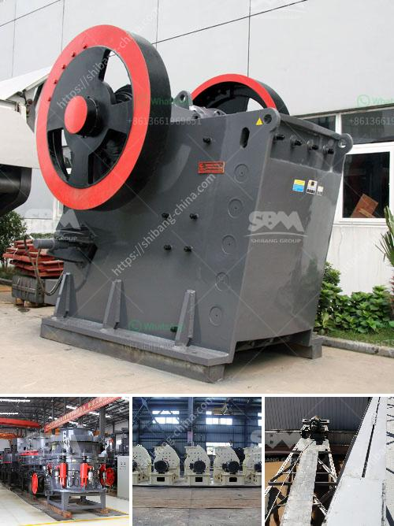

<h3>caco grinding grinder</h3>
When it comes to making delectable chocolates, one essential step in the process is grinding the cocoa beans into a fine powder. Traditionally, this task has been carried out using labor-intensive methods that consume a significant amount of time and effort. However, with the advent of the Caco Grinding Grinder, chocolate makers can now streamline their production process and achieve consistent, high-quality results.

The Caco Grinding Grinder is a revolutionary machine that has transformed the way cocoa beans are ground. This innovative device features a powerful motor and multiple grinding blades that work in tandem to pulverize the beans into a smooth, homogeneous paste. Its ergonomic design ensures effortless operation, making it an ideal solution for both small-scale artisans and large chocolate manufacturers.

One of the key advantages of the Caco Grinding Grinder is its efficiency. Unlike traditional methods that involve manual grinding, this machine can process large quantities of cocoa beans in a relatively short amount of time. This not only saves valuable labor hours but also increases productivity, allowing chocolate makers to meet the growing demands of the industry.

Moreover, the Caco Grinding Grinder guarantees consistency in the grind, ensuring that each batch of chocolate is of the same quality. This is achieved through the precise control it offers over the grinding process, allowing operators to adjust the speed and duration to achieve the desired fineness. Consistent grinding results in a smoother, silkier texture, enhancing the overall taste and mouthfeel of the chocolate.

Furthermore, the Caco Grinding Grinder offers versatility in terms of the types of cocoa beans it can process. Whether it is Criollo, Trinitario, or Forastero, this machine can handle them all. This flexibility means that chocolate makers can explore different flavors and create unique blends by experimenting with various bean varieties without the need for separate grinding equipment.

In addition to its efficiency and versatility, the Caco Grinding Grinder also prioritizes hygiene and ease of maintenance. Its stainless steel construction ensures durability and easy cleaning. The removable parts allow for quick disassembly and reassembly, reducing downtime and facilitating maintenance procedures. These features make the machine suitable for both commercial use and small-scale operations.

Furthermore, the Caco Grinding Grinder is equipped with advanced safety features to protect operators and prevent accidents. From automatic shut-off mechanisms to overheat protection, this machine ensures a safe and secure grinding experience.

In conclusion, the Caco Grinding Grinder is a game-changer for the chocolate industry. Its efficient and consistent grinding capabilities, coupled with its versatility, hygiene, and safety features, make it an invaluable tool in the chocolate-making process. No longer do chocolate makers need to rely on labor-intensive and time-consuming grinding methods; instead, they can embrace this innovative machine to enhance their productivity and create exquisite chocolates with ease.
<h3>Contact us</h3><ul><li><strong>Whatsapp:&nbsp;<a href="https://wa.me/8613661969651">+8613661969651</a></strong></li><li><a href="https://swt.shibang-china.com/?git&amp;zhl&amp;caco grinding grinder"><strong>Online Service(chat now)</strong></a></li></ul><h3>Related</h3><ul><li><a href='belt conveyor design free.md'>belt conveyor design free</a></li><li><a href='how to grind sand into powder.md'>how to grind sand into powder</a></li><li><a href='how to make limestone powder.md'>how to make limestone powder</a></li><li><a href='coal crushing plant for sale in south africa.md'>coal crushing plant for sale in south africa</a></li><li><a href='compact vibrating ball mill manufactures.md'>compact vibrating ball mill manufactures</a></li></ul>