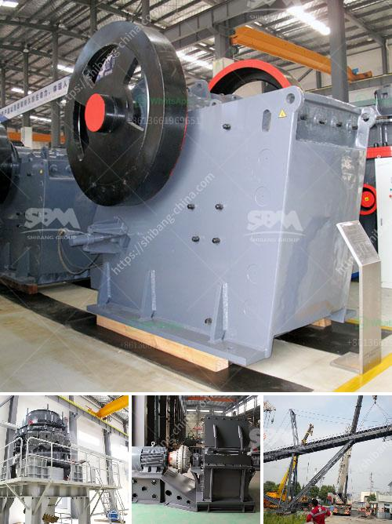

<h3>calcite crusher machine</h3>
Calcite is a widespread mineral that exists in sedimentary, metamorphic, and igneous rocks. The calcite crystal is stable at a high temperature, making it an essential component in the manufacturing of numerous everyday products. Calcite is known for its great hardness, making it an excellent abrasive material. It is also widely used in construction as a raw material for cement and mortar.

To extract calcite from its natural form, it requires mechanical crushing and grinding. Calcite crusher machine is used to break the raw calcite material into smaller size particles. In the calcite crushing plant, the jaw crusher is usually used as the primary crusher. It is suitable for primary and secondary crushing of all kinds of minerals and rocks with compressive strength less than 320 MPa.

The calcite crusher machine includes jaw crusher, cone crusher, impact crusher and mobile crusher. These crusher machines can also be customized according to specific requirements of clients. In the calcite crushing plant, cone crusher is mainly used for secondary crushing. Then, the materials are sent into impact crusher for further crushing.

Calcite crushing equipment is reliable in performance and smooth in operation. It has a certain market competitiveness and is deeply favored by customers. Shanghai Joyal Mining Machinery Co., Ltd. is a professional manufacturer of ore processing machinery and equipment. The calcite crusher produced by Joyal is with high quality, stable performance, and low energy consumption. Whether from the first consultation, design, or after-sales service, we have professional technical personnel to provide guidance and optimization solutions. Joyal not only provides a complete set of pre-sale, sale, and after-sales services but also provides customers with comprehensive and systematic training on operation and maintenance to prevent accidents in the production process and ensure the efficient and stable operation of equipment.

In conclusion, calcite crusher machine plays an important role in the mining process of calcite. The high quality and low price of the equipment ensure it is welcomed by the majority of users.
<h3>Contact us</h3><ul><li><strong>Whatsapp:&nbsp;<a href="https://wa.me/8613661969651">+8613661969651</a></strong></li><li><a href="https://swt.shibang-china.com/?git&amp;zhl&amp;calcite crusher machine"><strong>Online Service(chat now)</strong></a></li></ul><h3>Related</h3><ul><li><a href='used stone crushers for sale india.md'>used stone crushers for sale india</a></li><li><a href='cost of crushing and screening.md'>cost of crushing and screening</a></li><li><a href='crushers manufacturer turkey.md'>crushers manufacturer turkey</a></li><li><a href='24 36 jaw crusher for sale usa.md'>24 36 jaw crusher for sale usa</a></li><li><a href='gravel making crusher.md'>gravel making crusher</a></li></ul>